# Engine Entity Ladder — Smallest to Largest

> *"The world is a function of (seed, time, observations). Everything in the engine that COMPUTES potential lives somewhere on this ladder."*

This document enumerates every entity the engine maps and computes potential for, ordered from atomic substance (a unit of grain, a flake of mica) up to cosmic state (the weather of the world). It is a deliberate **4D → 2D collapse** — the four axes being:

1. **Granularity** (atom → world)
2. **Time** (round → year, plus event-driven and observation-only)
3. **Spatial binding** (tile → hex → abstract)
4. **Domain** (economy / ecology / social / military / religious / narrative / intelligence)

All four are projected into one ordered ladder so the full surface is scannable in a single read. The progression is **compositional**: each tier is *made of* the tier below and *belongs to* the tier above. Tier 0 substances flow up through items → containers → operations → settlements → regions → kingdoms → world, with the planetary weather state as the capoff that loops back down through κ inheritance.

## Spine

```mermaid
flowchart TD
  T0[T0 ATOMIC SUBSTANCE<br/>commodity · affix · seed · rumor · adaptation · tier]
  T1[T1 ITEMS<br/>ItemV2 · LootItem · CargoItem · GemType · PropertyDeed · SiegeWeapon · Recipe]
  T2[T2 CONTAINERS<br/>Container · BankAccount · BankVault · InventorySlot · Loan · BullionShipment]
  T3[T3 LIVING UNIT<br/>MMCharacter · MMNPC · ClergyMember · Performer · Merchant · Spy · Provider]
  T4[T4 ACTOR<br/>MMActor · MMLocalActor · MMIntelligence · NPCAgenda]
  T5[T5 SMALL COLLECTIVE<br/>Herd · WildHerd · MonsterActor · Party · Household · ArmyUnit · Family]
  T6[T6 SCENE<br/>MMScene · Combatant · MMSession · SceneCard · DowntimePeriod]
  T7[T7 ROOM / BUILDING<br/>RoomLayout · DungeonRoom · Corridor · HubBuilding · HubStreet · HubPOI]
  T8[T8 OPERATION<br/>FarmPlot · Deposit · Extraction · MineLayer · Workshop · Temple · Venue · Study · Job · Contract · Title]
  T9[T9 CHUNK<br/>HubChunk 100x100]
  T10[T10 DISTRICT<br/>HubDistrict · DistrictHub]
  T11[T11 SETTLEMENT<br/>Hub · Settlement scalars · Market · Cuisine · TechWeb · GuildChapter · KnowledgePool · InfrastructureState]
  T12[T12 EDGE / ROUTE<br/>WorldEdge · OwnershipSegment · DiscoveredSite · DungeonGate · Caravan · Shipment]
  T13[T13 REGION<br/>Region node · Biome · WildFauna habitat · EcologyInteractables · WaterBody · AdaptationPool]
  T14[T14 KINGDOM<br/>Kingdom node · CurrencySystem · Faction · DiplomaticRelation · RoyalTitle]
  T15[T15 CONTINENT<br/>Continent node · Pantheon · Deity · NamePool culture · CampaignNarrative]
  T16[T16 PLANET<br/>Planet node · κ inheritance root · Climate zones]
  T17[T17 WORLD STATE<br/>worldDay · season · planetary weather · canonical .tpb · TP graph]
  T0 --> T1 --> T2 --> T3 --> T4 --> T5 --> T6 --> T7 --> T8 --> T9 --> T10 --> T11 --> T12 --> T13 --> T14 --> T15 --> T16 --> T17
  T17 -. kappa inheritance .-> T0
```

## Legend

**Spatial** — where the entity is positioned:

| Code | Meaning |
|---|---|
| `TILE` | Explicit `(x, y)` tile coords (combat scene grid, room interior) |
| `BUILDING` | Chunk-local `(x, y, w, h, rotation)` — buildings inside hub chunks |
| `LINE` | 1D mile-marker on a world edge |
| `NODE` | Bound to a `.tp` node, no finer coords |
| `EDGE` | Bound to an edge, no specific mile (caravan in transit at `currentSegment`) |
| `HEX` | Bound to a world `(q, r)` hex coordinate |
| `REGION` | Bound to a region node, no finer position |
| `HIER` | Pure hierarchy / set membership (faction → controlled nodes) |
| `ABSTRACT` | No spatial binding (currencies, deities, contracts, memories) |

**Compute** — who runs the math (cadence shorthand: `D` daily, `W` weekly, `M` monthly, `Q` quarterly, `S` semesterly, `Y` yearly, `R` round, `O` observation-only, `E` event-driven):

| Code | Meaning |
|---|---|
| `MMxxx N` | Managed by an `ISimulatedMM`, ticks at cadence `N` |
| `pure-fn` | Pure functions called by other layers; no MM, no state of its own |
| `catalog` | Immutable substrate (no compute, just reference data) |
| `derived` | Computed on read from other state |
| `TPB-replay` | State reconstructed from append-only log on observation |

**State** — where it lives:

| Code | Meaning |
|---|---|
| `κ.X` | Written to κ domain `X` on a node via `writeDomain` |
| `mm_states` | The MM's own domain blob (DB table of the same name) |
| `tpb_entries` | Append-only log row |
| `entity-reg` | TP entity registry (position index inside `tp.ts`) |
| `domain-mem` | Held in the MM's in-memory domain object only (re-derived on resolve) |
| `IDB` | Browser IndexedDB only (party-side) |
| `catalog` | Code-resident constant table |

---

## Tier 0 — ATOMIC SUBSTANCE

The bedrock. Most are CATALOG (immutable schema rows) — they have zero compute but everything composes from them. The few stateful ones (rumors decay, adaptations evolve) are tracked as event-driven scalars.

| Entity | Made of | Belongs to | Spatial | Compute | State |
|---|---|---|---|---|---|
| **Commodity** (50+ catalog: grain, meat, fish, water, coal, timber, stone, iron_ore, copper_ore, gold_ore, herbs, leather, cloth, salt, iron, weapons, armor, tools, bread, ale, wine, spices, horses, magic_components, sand, potash, clay, peat, …) | — | items, deposits, market prices | ABSTRACT | catalog | catalog (`production-chain.COMMODITIES`) |
| **Affix** (11: SHARP, HEAVY, SWIFT, LIGHT, RESILIENT, BRITTLE, CONDUCTIVE, INERT, LUMINOUS, CURSED, LEGENDARY) | — | ItemV2, MaterialLot | ABSTRACT | derived from `(lotId, day, makerCert, skillBonus, tierBonus)` via `mintAffixes` | derived (`material-affixes.ts`) |
| **Tier (F → EX, 10 steps)** | — | tool item, deposit gate, monster CR, dungeon difficulty, knowledge unlock, study completion days | ABSTRACT | catalog (`tier.ts`) | catalog |
| **Tool archetype** (per purpose: fishing-tool, mining-tool, harvesting-tool, …) | tier | TechWeb, Deposit access | ABSTRACT | catalog (`tool-archetypes.ts`) | catalog |
| **Knowledge seed** (5 categories: material, creature, botanical, technique, lore) | — | KnowledgePool | ABSTRACT | event (`injectExplorationSeeds` / Trade / Player / Research) | mm_states + κ.knowledge.seeds |
| **Rumor** (5 categories: monster, geography, history, religion, politics) | sourceChain[] | MMLore, GuildIntelligence, Caravan cargo | ABSTRACT | MMLore M (decay) + E spread via caravan | mm_states (lore) |
| **Adaptation** (10: ARMORED, SWIFT, PACK, REGEN, STEALTH, REFLECT, DRAIN, SPLIT, ADAPT, CUNNING) | — | AdaptationPool, MonsterActor, DungeonGate | ABSTRACT | drawn from pool via `selectAdaptations`; evolved via `evolvePool` E | κ.ecology.adaptations[species] |
| **Adaptation fitness** (per adaptation: spawned, survivedClears, causedCasualties, lastSeenAtGen) | — | AdaptationPool | ABSTRACT | E on gate clear / respawn | κ.ecology.adaptations[species].fitness |
| **Damage type** (13: acid, bludgeoning, cold, fire, force, lightning, necrotic, piercing, poison, psychic, radiant, slashing, thunder) | — | Combatant attack, damage MF | ABSTRACT | catalog | catalog |
| **Condition** (D&D 5e: poisoned, burned, frozen, prone, stunned, blinded, charmed, frightened, restrained, grappled, paralyzed, petrified, exhausted, unconscious, incapacitated, invisible, deafened) | — | MMCharacter, Combatant | ABSTRACT | catalog + applied per round | mm_states (character) |

---

## Tier 1 — ITEMS

Discrete physical things made of substance. Items carry affixes, accumulate quality, and end up in containers or on bodies.

| Entity | Made of | Belongs to | Spatial | Compute | State |
|---|---|---|---|---|---|
| **ItemV2** (forged item) | ingot + recipe + affixes | character inventory, container, loot | ABSTRACT | mfForge / mfSmelt / mfIdentify (pure-fn) | mm_states (character or container) |
| **LootItem** (8 types: weapon, armor, potion, scroll, gem, art_object, coin, reagent, key; 5 rarities) | rarity + gpValue + magical | RoomLoot | TILE (inside RoomLayout) | dungeon-stamp pure-fn (deterministic) | mm_states (dungeon) |
| **CargoItem** (1 commodity + qty + weight + perishable) | commodity | Caravan, Shipment | EDGE | pure-fn | mm_states (caravan / shipment) |
| **GemType** (~20 catalog × 5 tiers: ornamental → jewel) | tier | adventurer loot, currency exchange | ABSTRACT | catalog + appraisal d20 | catalog |
| **PropertyDeed** (3 types: building, land, edge_segment) | nodeId + appraisedValueGP | Household, Faction, Loan collateral | NODE | pure-fn (`transferDeed`) | banking domain (services tables) |
| **SiegeWeapon** (6 types: battering_ram, catapult, trebuchet, siege_tower, ballista, scorpion) | crew + condition | ArmyUnit | ABSTRACT | pure-fn (`SIEGE_WEAPON_STATS`) | mm_states (warfare) |
| **Recipe** (input commodities → output goods) | inputs[], outputs[], skill, difficulty | Workshop, Profession | ABSTRACT | catalog (`production-chain.RECIPES`) + `rollQuality` | catalog |
| **MaterialLot** (extracted/refined batch carrying affixes) | commodity + quality + affixes[] | Container, Caravan, Workshop input | ABSTRACT | mfSmelt / extraction output | domain-mem in MMExtraction |
| **InventorySlot** (a merchant's stock line) | commodity + qty + purchasePrice + quality | Merchant | ABSTRACT | weekly merchant decision (`simulateMerchantDecision`) | mm_states (market) |
| **Currency-denomination** (cp/sp/ep/gp/pp under per-kingdom names) | metal | CurrencySystem | ABSTRACT | catalog (`BASE_DENOMINATION_RATES`) | catalog |

---

## Tier 2 — CONTAINERS

Bounded storage. Substances/items live inside; transfers are the verbs.

| Entity | Made of | Belongs to | Spatial | Compute | State |
|---|---|---|---|---|---|
| **Container** (9 types: treasury, vault, warehouse, granary, chest, library, scroll_rack, gallery, armory) | items + currency | Hub, District, Building, character inventory | NODE | pure-fn (`buildContainers`) | mm_states (containers / inventory) |
| **BankAccount** (3 types: custody, savings, trade × 8 owner types: character/npc/party/household/guild/faction/settlement/trading_company) | currency | BankVault, owner | ABSTRACT | MMBanking W (interest, fees) | mm_states (banking) |
| **BankVault** (FULL RESERVE — vaultGP + loanedOutGP + totalDepositsGP) | currency | one bank, one settlement, one faction | NODE + entity-reg as `bank` | MMBanking W | mm_states (banking) |
| **Loan** (5 collateral types: none/property/inventory/title/guild_share) | principal + interest + collateral ref | BankAccount + Vault | ABSTRACT | MMBanking W (payments, default) | mm_states (banking) |
| **BullionShipment** (4 statuses: staged → in_transit → delivered/lost) | currency + edgeId + caravanId | source Vault → destination Vault, via Caravan | ABSTRACT → EDGE on pickup | E (MMBanking + MMCaravan handoff) | mm_states (banking pendingShipments) |
| **LedgerEntry** (per-account append-only, 8 types: deposit/withdrawal/interest/fee/loan_disbursement/loan_payment/loan_default/transfer/seizure) | account + amount | BankAccount | ABSTRACT | E on every transaction | mm_states (banking ledger) |

---

## Tier 3 — LIVING UNIT (single agent)

One body, one will. Stat block + position + status.

| Entity | Made of | Belongs to | Spatial | Compute | State |
|---|---|---|---|---|---|
| **MMCharacter** (PC, D&D 5e) | 6 abilities, 18 skills, classes, HP/AC, conditions[], spellSlots, deathSaves, status (active/unconscious/dead/petrified) | MMParty | NODE (party node) | pure-fn (derive on demand) + state mutations on damage/heal/rest | mm_states (character) + IDB |
| **MMNPC** (full-spec NPC) | 6 abilities, 10 roles, 5 dispositions, loyalty[0-100], homeNodeId, currentNodeId, knowledge[], personality (traits/ideals/bonds/flaws), 10 services, dailyCost | MMFollowers (if party-attached) or settlement | NODE + entity-reg as `npc` | D tick (loyalty drift, daily cost) | mm_states (npc) |
| **NPCAgenda** (Maslow stack: 5 needs — survival/safety/belonging/esteem/purpose) | needs[] + currentGoal + motivation | per-NPC | NODE (NPC's currentNode) | MMNpcAgenda D | mm_states (npc_agenda) |
| **AgentMemory** (4 types: episodic/semantic/emotional/legendary; vividness 0-1) | event + worldDay + importance | MMIntelligence (one mind) | ABSTRACT | MMIntelligence M (decayMemories) | mm_states (intelligence) |
| **IdentityAnchor** + **KnowledgeBoundary** (an agent's "who am I, what do I know") | name, role, allowedScopes, exclusions | MMIntelligence | ABSTRACT | E (recordKnowledge) | mm_states (intelligence) |
| **ClergyMember** (5 ranks: acolyte → chosen) | piety + rank + templeId + domainFocus | Temple → Deity | NODE (temple's settlement) | MMReligion Y | mm_states (religion) |
| **Performer** (8 performance types × 6 venue categories) | specialties[] + skillMod + reputation + patronId | settlement | NODE | MMEntertainment W | mm_states (entertainment) |
| **SpyAgent** (7 mission types: intelligence/sabotage/assassination/counterintel/steal_knowledge/spread_propaganda/incite_revolt) | npcId + skillMod + cover | Faction | NODE (cover settlement) | MMWarfare M | mm_states (warfare) |
| **Merchant** (6 tiers: peddler → consortium, 18 specializations) | tier + specialization + capital + inventory + reputation + personality (greed/patience/honesty/risk) + employeeCount + goal | SettlementMarket, possibly Venue | NODE | MMMarket W (`simulateMerchantDecision`) | mm_states (market) |
| **ServiceProvider** (8 types: bank/pmc/legal/logistics/artisan/discretion/temple/guild) | tier + fameScore + capitalGp + offeredServices[] | Hub | NODE | MMServices W | mm_states (services) |
| **NPCPartyMember** (5 roles: tank/healer/damage/utility/caster) | level + combatRating + alive | NPCAdventurerParty | NODE | passive | mm_states (guild) |

---

## Tier 4 — ACTOR (agent with intent and a TPB)

A living unit that *decides*. Has drives, goals, schemes, and a life-history TPB.

| Entity | Made of | Belongs to | Spatial | Compute | State |
|---|---|---|---|---|---|
| **MMActor** (territory actor — Duke-tier, multi-node) | drives + goals[] + advisors[] + demerits + resources + abilityScores + schemes[] + territoryNodeIds[] + tpb[] | Faction (often as leader) | HIER (territory subtree) | MMActor W + M + Q + S + Y (horizon-graded) | mm_states (actor) |
| **MMLocalActor** (intra-hub actor — tavern owner, smith, etc.; 17 occupations) | drives + goals + occupation + LocalResources (gold/staff/goods/reputation/contacts) + activeAction | one hub | NODE | MMLocalActor W | mm_states (local_actor) |
| **MMIntelligence** (the mind behind an agent) | identity + knowledge + memories | one agent (NPC, faction-as-agent, world-as-agent) | NODE (agent location) + entity-reg as `agent` | MMIntelligence M | mm_states (intelligence) |
| **Scheme** (an active MF loop inside an actor) | action + horizon + resources committed + progress + outcome | MMActor or MMLocalActor | ABSTRACT | tickAccumulate progresses, rollScheme resolves on horizon | domain-mem |
| **Action template** (catalog of moves, ~30: economic/military/political/diplomatic/criminal/religious/personal/scholarly/financial/naval/espionage/entertainment) | type + horizon (weekly→life) | Actor decision pool | ABSTRACT | catalog (`intent.ts ACTION_TEMPLATES`) | catalog |
| **Drives** (6: power, wealth, faith, knowledge, safety, legacy + 2 more: revenge, duty) | scalar 0-100 | actor | ABSTRACT | mutate on event | mm_states (actor) |

---

## Tier 5 — SMALL COLLECTIVE (multiple agents bound)

Groups of agents that move/act/produce together. The middle layer between the individual and the institution.

| Entity | Made of | Belongs to | Spatial | Compute | State |
|---|---|---|---|---|---|
| **Herd** (domesticated, 12 species × 3 age tiers — cattle/sheep/goats/pigs/chickens/ducks/horses/oxen/donkeys/bees/rothe/giant_goats; 5 categories: MEAT/DAIRY/EGGS/MOUNT/LABOR/MULTI) | young + adults + elders + pregnancies + health + monthly yields | Hub | NODE + entity-reg as `herd` | MMHusbandry W (yield) + M (births/deaths/aging) | mm_states (husbandry) + κ.economy.commodities |
| **WildHerd** (6 starter species: deer/rabbit/boar/mountain-goat/fox/owl × 4 trophic roles × 4 formations × 5 statuses) | population + daysHungry + foodSecurity + formation + status + edgeMile | Region | NODE or EDGE (migrating) | MMWildFauna D (graze, migrate, decimate) | κ.ecology.herds[id] |
| **AdaptationPool** (per species per region) | weights{adaptation} + generation + fitness | one region | REGION | E on gate clear (`evolvePool`) | κ.ecology.adaptations[speciesId] |
| **MonsterActor** (an intelligent monster's camp + leader + claimed territory) | leaderCR + speciesId + population + troops + foodSecurity + dangerRadius + adaptations[] + claimedEdgeSegments[] + tenure | a region (camp) + edges they patrol | NODE or LINE (campMileMarker) | MMMonsterActor M (advancement, challenges, hunts) | mm_states (monster_actor) |
| **NPCAdventurerParty** (3-5 members, mixed roles) | members[] + partyLevel + combatRating + travelLog[] + reputation + gold | GuildChapter | NODE (homeChapterNode → traveling on jobs) | MMGuild W | mm_states (guild parties) |
| **MMParty** (PC party) | MMCharacter[] + marchingOrder + shared gold + notes | MMAdventure | NODE (single party node) | passive (no autonomous tick) | mm_states (party) + IDB |
| **MMFollowers** (party-attached NPCs, dual-pool) | local map + global map | MMParty | local: NODE (party); global: NODE (own home) | D tick (loyalty drift, daily cost) | mm_states + IDB |
| **ArmyUnit** (5 tiers: squad/platoon/company/battalion/legion = 5/25/125/625/3125; 8 unit types: infantry/cavalry/archers/pikemen/siege_crew/mages/scouts/navy) | currentStrength + readiness + morale + equipmentTier + commanderId + weeklyUpkeepGP | Faction | NODE (regionId) | MMWarfare M (readiness decay, upkeep) | mm_states (warfare) + κ.military |
| **Household** (8 types: family/noble_house/merchant_house/guild_hall/temple/commune/criminal_gang/adventuring_company) | members[] (10 roles: head/spouse/heir/child/ward/elder/servant/retainer/guest/prisoner) + treasury + properties[] + standing (8 levels: outcast → royal) + heraldry | Settlement | NODE | MMSocial M (recalc standing, succession) | mm_states (social) |
| **FamilyRegistry** (the koseki — settlement-bound family record) | entries[] (head/spouse/child/adopted/ward) + headId + householdId | Settlement | NODE (registeredAt settlement) | E (marriage, birth, death, adoption, divorce) | mm_states (social) |
| **KinshipLink** (16 types: parent/child/sibling/spouse/grandparent/grandchild/uncle/aunt/nephew/niece/cousin/step_*/in_law) | entity1 + entity2 + relationship + legitimacy (6 states) | abstract over households + registries | ABSTRACT | E (createKinshipLink) | mm_states (social) |
| **ChildPool** (settlement spare-children pool — MF twin-spawn) | spares[] (with motherId/fatherId/legitimacy/seed) | Settlement | NODE | E (every birth generates +1 spare) | mm_states (social) |
| **SpareChild** (a generated-but-unused child — drawn when settlement needs an NPC) | name + gender + parents + seed | ChildPool | ABSTRACT | E (drawFromChildPool) | mm_states (social) |

---

## Tier 6 — SCENE (bounded interaction in a window)

A single bounded interactive moment. Combat round / play session / downtime / encounter card.

| Entity | Made of | Belongs to | Spatial | Compute | State |
|---|---|---|---|---|---|
| **Combatant** (in combat, 4 statuses: active/unconscious/dead/fled) | side (party/enemy/neutral) + HP + AC + attack + damage dice + resistances/vulnerabilities/immunities + optional `position {x,y}` + optional `mobBehavior` | MMScene | TILE (when position present) | MMScene per round (mob-ai dispatch + attack pipeline) | mm_states (combat) |
| **MMScene** (combat encounter — pocket manifold at 6s tick) | combatants Map + initiativeOrder + round + isOver + victor | MMSession (when triggered from a combat card) | NODE (where combat takes place) | per-R (`executeRound`) | mm_states (scene) |
| **MMSession** (one play session, 3-4 hours) | scene cards[] (12 types: narrative/revelation/transition/encounter/exploration/puzzle/combat/chase/skill_challenge/loot/rest/milestone) + hooks + mutations + activeCombat | MMAdventure | HIER (campaign root) | E (advance/skip/applyChoice) | tpb_entries (session-scope) + mm_states |
| **SceneCard** (with content + GM notes + choices + worldMutations[]) | choices + locationId + npcs + combatSetup | MMSession | NODE (locationId) | E | mm_states (session) |
| **HookThread** (unresolved plot — for goldfish-party hook-back) | name + staleCount + priority + relatedCardIds[] + resolved | MMSession or MMAdventure (after session end) | ABSTRACT | E (advance increments staleCount) | mm_states (session/adventure) |
| **WorldMutation** (per-session world delta — add/remove/modify node, add/remove edge) | type + target + data + causedBy + sceneCardId | MMSession (collected) → applied to TP on `endSession` | ABSTRACT | E | mm_states (adventure) |
| **DowntimePeriod** (between sessions; 9 activities: crafting/training/research/working/socializing/recuperating/carousing/crime/religious) | activities[] + days + goldDelta | MMAdventure | ABSTRACT | E (resolveDowntime) | mm_states (adventure) |
| **DowntimeActivity** (one character's task during a downtime) | type + characterId + daysRequired + daysCompleted + goldCost | DowntimePeriod | ABSTRACT | E (completion check) | mm_states (adventure) |
| **SessionRecord** (post-end summary) | session + mutations + worldDay + worldDaysDuration | MMAdventure | ABSTRACT | E | mm_states (adventure) |

---

## Tier 7 — ROOM / BUILDING (bounded interior)

A single navigable interior. Either dungeon-room-with-tile-grid or hub-building-with-floors.

| Entity | Made of | Belongs to | Spatial | Compute | State |
|---|---|---|---|---|---|
| **DungeonRoom** (10 types: entrance/corridor/chamber/trap_room/treasure_room/shrine/lair/boss_chamber/dead_end/junction; 4 sizes + boss=24×24) | encounter + trap + puzzle + loot + exits[] + lighting (4 levels) + features[] | DungeonInterior | HIER (graph node in dungeon) | dungeon-interior pure-fn (deterministic from gate seed) | mm_states (dungeon) |
| **RoomLayout** (concrete tile grid, 12 tile types: floor/wall/door/pillar/pit/water/rubble/altar/chest/rune/stairs_up/stairs_down) | tileGrid[y][x] + doors + positioned content | DungeonRoom | TILE | dungeon-stamp pure-fn (seed-deterministic) | mm_states (dungeon) |
| **DoorAnchor** (4 walls: N/E/S/W) | wall + position + locked + lockDC | RoomLayout | TILE (specific tile) | pure-fn | mm_states (dungeon) |
| **PositionedEncounter** (within room) | speciesId + count + crEach + difficulty (6 levels) + behavior (6: ambush/patrol/guard/sleeping/feeding/ritual) + spreadRadius + avoidable + avoidDC | RoomLayout | TILE | pure-fn | mm_states (dungeon) |
| **PositionedTrap** (10 types: pit/dart/poison_gas/collapsing/magical_glyph/alarm/cage/flame_jet/flooding/teleport) | type + detectDC + disarmDC + damage + saveDC | RoomLayout | TILE | pure-fn | mm_states (dungeon) |
| **PositionedLoot** (6 containers: chest/corpse/altar/pile/sack/shelf) | items[] (LootItems) + trapped + hidden + searchDC | RoomLayout | TILE | pure-fn | mm_states (dungeon) |
| **PositionedFeature** (8 kinds: pillar/altar/pool/rubble/brazier/statue/banner/rune) | kind + blocksMovement + blocksLOS | RoomLayout | TILE | pure-fn | mm_states (dungeon) |
| **DungeonCorridor** (edge between rooms — 1D length + width + hazards + features) | length (tiles) + width (1-3) + hazards[] + features (locked_door/gate/collapse/darkness/magical_seal) | DungeonInterior (graph edge) | EDGE (dungeon-internal) | pure-fn | mm_states (dungeon) |
| **DungeonInterior** (full layout for one gate, generated on entry) | rooms[] + totalEncounterCR + bossRoom + roomsCleared + state (5 lifecycle: generated/in_progress/cleared/failed/abandoned) + generation count | DungeonGate | HIER | observation-driven (stamped from gate seed) | mm_states (dungeon) |
| **HubBuilding** (~40 types: residential 5 / commercial 8 / industrial 5 / religious 3 / civic 7 / special 8 / infrastructure 4) | type + position + size + rotation + ownerId + factionId + floors + interiorSeed | HubChunk | BUILDING (chunk-local x,y) | HubChunkManager (deterministic regenerate) | catalog-derived |
| **HubStreet** (4 types: main/side/alley/path × 4 materials: cobblestone/dirt/gravel/wooden) | points[] (polyline) + width + type + material | HubChunk | BUILDING (chunk-local polyline) | topology generator (deterministic) | catalog-derived |
| **HubPOI** (~20 types: fountain/statue/well/garden/bench/cart/water_pump/training_dummy/obelisk/etc.) | type + position + interactable | HubChunk | BUILDING | topology generator | catalog-derived |
| **Lot** (geometric subdivision of chunk) | center + vertices + area | HubChunk | BUILDING | topology generator | derived |

---

## Tier 8 — OPERATION / WORKSHOP / CONTRACT

A bounded ongoing endeavor. A farm produces; a forge crafts; a guild posts jobs; a temple hosts services; a contract is in force.

| Entity | Made of | Belongs to | Spatial | Compute | State |
|---|---|---|---|---|---|
| **FarmPlot** (4 plot sizes: garden/small_plot/field/large_estate; 5 tenures: serfdom/tenant/freehold/communal/monastic; 2 cultivations: mono/multi; 22 crop types) | crops[] + soilQuality + season + planted + growthDays | Settlement | NODE | MMAgriculture W (harvest when in season) | mm_states (agriculture) + κ.economy.commodities |
| **Deposit** (18 types: surface/shallow/deep/underwater/volcanic/arable/pasture/orchard/vineyard/forest/old_growth/managed/fishery/deep_sea/shellfish/herb_field/game_land/salt_flat/ley_line/planar_bleed/ruins; 5 quality grades) | primaryCommodity + secondaryCommodities + reserves + renewability + tier | a region/node | NODE | passive; ticked by Extraction | catalog instance + mm_states (extraction) |
| **Extraction** (active operation working a deposit) | depositId + assignedWorkers + workerEfficiency + outputContainerId + stockpile + status (idle/operating/maintenance/disrupted/exhausted) | Deposit + Container | NODE | MMExtraction W | mm_states (extraction) + κ.economy.commodities |
| **MineLayer** (10 layers F→EX deep at a mine node) | depth + resourceType + reserve + depletionRate + structuralIntegrity + hazardThreshold + revealed | Mine node | NODE | MMMineNode D (passive depletion) | κ.infrastructure.mineLayers |
| **FisheryOperation** (3 types: freshwater/saltwater/shellfish) | workers + boats + seasonalModifier | WaterBody | NODE | weekly tick (no dedicated MM yet) | mm_states (water) |
| **GatheringOperation** (6 types: wild_herbs/berries/mushrooms/roots/honey/nuts) | gatherers + terrain + season | Region terrain | REGION | weekly pure-fn | derived |
| **Workshop** (per recipe-runner — forge/bakery/alchemy_lab/brewery/etc.) | type + recipes available | Settlement | NODE | InfrastructureState M (unlocks) | κ.infrastructure.workshops |
| **Profession** (~25 standard: farmer/laborer/hunter/fisherman/healer/guard/miner/woodcutter/blacksmith/tanner/baker/brewer/carpenter/weaver/potter/alchemist/apothecary/armorsmith/weaponsmith/tailor/mason/scribe/enchanter/jeweler/goldsmith/shipwright/breeder/adventurer × 4 tiers: basic/journeyman/master/expert) | role + count + tier + requiredSeeds + workshopType + outputs + minPopulation | InfrastructureState | NODE | MMInfrastructure M | κ.infrastructure.professions |
| **Temple** (5 sizes: shrine/chapel/temple/cathedral/grand_cathedral) | deityId + condition + relicCount + consecrated | Settlement → Deity | NODE | MMReligion Y (faithOutput) | mm_states (religion) + κ.religion.temples |
| **Venue** (13 types: cart/stall/tent/shop/workshop_shop/emporium/warehouse_outlet/auction_house/exchange/bazaar_stall/guild_hall/temple_market/black_market) | rentCostWeekly + displayCapacity + storageCapacity + customerCapacity + status | Hub or District | NODE | MMMarket W | mm_states (market) |
| **ServiceContract** (21 service types × 3 urgencies: routine/priority/emergency) | providerId + clientId + serviceType + urgency + estimatedSlots + slotsConsumed | ServiceProvider + client | ABSTRACT | MMServices W (slot consumption) | mm_states (services) |
| **RiskContract** (insurance — 9 covered events: cargo_loss/route_attack/theft/fire/flood/death/injury/contract_default/magical_accident) | providerId + clientId + coveredEvents[] + coverageLimitGp + premiumGp + durationDays | ServiceProvider | ABSTRACT | MMServices W (expiry check) | mm_states (services) |
| **Patronage** (noble↔performer) | patronId + performerId + weeklyStipend + exclusivity | Performer + Noble | ABSTRACT | MMEntertainment W | mm_states (entertainment) |
| **Title** (16 ranks: emperor/king/archduke/duke/marquess/count/viscount/baron/baronet/knight/lord/mayor/alderman/guildmaster/high_priest/abbot; 8 successions: primogeniture/male_primogeniture/ultimogeniture/gavelkind/elective/appointed/conquest/seniority) | holderId + domainNodeId + rights[] + obligations[] + status (active/vacant/disputed/abolished) | Settlement domain | NODE (domain) | MMSocial M (succession on vacancy) | κ.social.titles |
| **Contract** (~30 types across 7 categories: personal/service/feudal/religious/economic/oath/criminal; 12 statuses: proposed→fulfilled) | parties[] + visibility (4) + obligations + rights + jurisdictionId + durationType | Settlement (jurisdictionId) | NODE | MMSocial M (expire) | mm_states (social) |
| **Jurisdiction** (10 types: royal_court/noble_court/church/temple/guild/city/village/tribal/divine/criminal) | scopeNodeId + authorityId + precedence + recognized contract types + enforcement powers | Authority entity | NODE (scope) | passive | mm_states (social) |
| **GuildJob** (6 types: clear_gate/bounty/escort/patrol/investigate/retrieve × 5 dangerTiers; 6 statuses: open/claimed/in_progress/completed/failed/expired) | targetId + chapterNodeId + reward + dangerTier + edgeId + expiresDay | GuildChapter | NODE (chapter) + EDGE (target) | MMGuild W (lifecycle + matching) | mm_states (guild) + κ.guild.chapters |
| **TravelLogEntry** (one party-day on one edge) | sitesFound[] + monsterSightings[] + roadConditions[] + dangerAssessment | NPCAdventurerParty | EDGE | E (per traversal day) | mm_states (guild) |
| **Scheme** (an actor's active in-progress action) | action + horizon + resources committed + progress + outcome | MMActor or MMLocalActor | ABSTRACT | progresses W; resolves at horizon end | domain-mem |
| **StudyEntry** (per character × resource × hub) | charId + resourceId + tier (F→EX) + start day + complete day | character + hub | ABSTRACT | TPB-replay (start_study + complete_study writeKappa actions) | tpb_entries |
| **KnowledgePool** (per hub OR institution) | seeds[] + realizedPotentials[] + availableWorkshops/Recipes/Roles/Commodities | Hub or institution | NODE | MMKnowledgePool M (or via MMInfrastructure) | mm_states (knowledge) + κ.knowledge.seeds |
| **InfrastructureState** (settlement evolution tracker, 5 tiers: hamlet→capital) | population + hasTradeRoute + knowledgePool + activeProfessions Map + formedGuilds[] + workshops[] + recipes[] + commodities[] + specializations[] + developmentScore | Settlement | NODE | MMInfrastructure M | mm_states (infrastructure) + κ.infrastructure.* |
| **NamePool** (per culture: cormyrian / sword_coast / drow / dwarven / halfling × 4 lists) | masculine[] + feminine[] + neutral[] + familyNames[] | Cultural belt | catalog | catalog | catalog (`social.NAME_POOLS`) |

---

## Tier 9 — CHUNK

A 100×100 unit area inside a hub. Generated on demand from seed; LRU-cached. Buildings + streets + POIs live here.

| Entity | Made of | Belongs to | Spatial | Compute | State |
|---|---|---|---|---|---|
| **HubChunk** (100×100, 6 topology types: natural/planned/hybrid/radial/linear/clustered) | buildings[] + streets[] + pois[] + edges{N,S,E,W to neighbor chunks} + districtType + topology + seed | HubDistrict | BUILDING (chunkX, chunkY in hub grid) | HubChunkManager generate-on-demand (deterministic from seed) | derived (cached) |
| **HubObserverState** (per character — what chunks are loaded for them) | currentChunk + loadedChunks + trajectory + discoveredBuildings + discoveredDistricts + knownNPCs | one character in one hub | BUILDING | E (movement update) | IDB (per-character) |

---

## Tier 10 — DISTRICT

A thematic group of chunks within a hub. The district is where κ-overrides for law/wealth/crime apply.

| Entity | Made of | Belongs to | Spatial | Compute | State |
|---|---|---|---|---|---|
| **HubDistrict** (16 types: center/residential/commercial/industrial/religious/administrative/noble/slums/docks/military/academic/entertainment/magical/foreign/garden/necropolis; 6 wealth levels × 6 crime levels) | chunkCoords[] + topology + population + wealthLevel + crimeLevel + factions{} + notableLocations + atmosphere | Hub | NODE (district .tp node, child of settlement) | HubGenerator pure-fn (deterministic) | catalog-derived + κ override slots |
| **DistrictHub** (a district as a sub-hub from `hub-builder.ts`) | node + type + population + containers[] + localActorSlots + marketSpecialization + market[] | Hub | NODE | passive | mm_states (hub) |

---

## Tier 11 — SETTLEMENT (the hub)

The unit that civilization measures. 6 sizes from outpost to metropolis. The leaf of the .tp tree where the 6 leaf-only κ domains attach.

| Entity | Made of | Belongs to | Spatial | Compute | State |
|---|---|---|---|---|---|
| **Hub / Settlement** (6 sizes: outpost/hamlet/village/town/city/metropolis; 6 topology types) | districts[] + chunkGrid + keyLocations + defenses + economy + governance + services{10 boolean flags} + residentNPCs + visitingNPCs + state{isUnderAttack/Plagued/Famine/Occupied + mood} | Region | NODE | passive — but every layered MM anchored to this node ticks | mm_states (settlement) + κ.settlement / .market / .infrastructure / .knowledge / .guild / .water |
| **Settlement scalar bag** (population, stability, prosperity, unrest, defenseLevel, tradeModifier, foodSecurity, foodVariety, waterLevel, culturalScore, faithLevel, loreAccess, bankingActivity) | event-pool roll outcomes | one Hub | NODE | MMSettlement W (event pool roll) | κ.settlement |
| **SettlementMarket** (full market state) | prices Map + merchants[] + venues[] + activeEvents[] + taxRate | one Hub | NODE | MMMarket W | mm_states (market) + κ.economy.commodities |
| **MarketEvent** (16 types: shipment_arrived/delayed/lost/warehouse_fire/spoilage/festival_demand/military_requisition/noble_order/price_war/price_fixing/new_merchant/merchant_bankruptcy/foreign_traders/trade_fair/embargo_effect/black_market_crackdown) | priceMul + supplyMul + demandMul + durationWeeks | SettlementMarket | NODE | MMMarket W (roll on d20≤3) | mm_states (market) |
| **HubFoodState** (cuisine state — 6 cuisine regions) | cuisine + primaryFuel + availableFoods[] + averageMealQuality (5 levels) + varietyScore (0-10) + foodMorale + foodHealth | one Hub | NODE | MMCooking M | mm_states (cooking) + κ.culture.food |
| **Technology web (unlockedTech)** (per-purpose tier map: fishing-tool→F/E/D/…; ~10 purposes) | Record<purpose, Tier> | one Hub | NODE | MMTechnologyWeb W | κ.knowledge.unlockedTech + mm_states (tech_web) |
| **GuildChapter** (6 guild types: adventurers/merchant/mage/thieves/artisan/religious; 5 ranks for adventurers: copper→platinum) | partyIds[] + localJobIds[] + facilities[] + reputation + intelligence (knownSites/threatReports/roadReports/failureReports) | Guild → Hub | NODE + entity-reg as `guild_chapter` | MMGuild W | mm_states (guild) + κ.guild.chapters |
| **Library** (per-hub knowledge holding, 4 tiers) | tier + bookCount + scrolls + researchSpeed + knowledgeIds[] | Hub | NODE | MMLore M (research progress) | mm_states (lore) + κ.knowledge.library |

---

## Tier 12 — EDGE / ROUTE

The corridors between settlements. Where transit happens. Where dungeon gates spawn. Where road infrastructure is claimed.

| Entity | Made of | Belongs to | Spatial | Compute | State |
|---|---|---|---|---|---|
| **WorldEdge** (between two hubs, 11 terrain types: plains/forest/hills/mountains/swamp/desert/tundra/jungle/coastal/river_valley/underground) | distanceMiles + terrain + segments[] + discoveredSites[] + traversed + exploredFraction + fastTravelUnlocked | Region (hosts the edge) | LINE (1D mile-marker space) | passive (mutated by traversal) | mm_states (world_edge) |
| **OwnershipSegment** (a controlled stretch of an edge) | startMile + endMile + controllerId + roadCondition (5: none/trail/dirt_road/road/paved) + dangerLevel (5: safe/patrolled/risky/dangerous/deadly) + toll + patrolStrength | WorldEdge | LINE (segment range) | E (claim/upgrade/patrol changes) | mm_states (world_edge) |
| **DiscoveredSite** (8 types: resource_deposit/ruin/camp_site/landmark/settlement_seed/monster_lair/shrine/crossing) | mileMarker + siteType + name + depositInfo + explored + discoveredOnDay | WorldEdge | LINE (specific mile) | E on traversal discovery roll (`tickTraversal`) | mm_states (world_edge) |
| **DungeonGate** (4 types × 5 tiers: ruin/lair/portal/corruption × Minor/Standard/Dangerous/Deadly/Catastrophic; 5 lifecycle states: dormant/active/overflowing/capped/cleared) | tier + speciesId + internalCapacity + currentInternal + spawnRate + spilloverThreshold + overflowRadius + leaderEmerged + adaptations[] + timesCleared | Edge (siteId) → Region (κ.ecology) | LINE | MMDungeonGate W | mm_states (dungeon_gate) + κ.ecology.dangerLevel/dominantThreats |
| **Caravan** (7 types: pack_mule/cart/wagon/barge/ship/airship/teleport_circle; 7 statuses: loading/en_route/resting/under_attack/arrived/destroyed/stranded) | type + ownerId + cargo[] + guards + crew + currentSegment + tollsPaid + rumorsCarried + booksCarried + bullionAboard | Edge → destination Hub on arrival | EDGE → NODE on arrival + entity-reg as `caravan` | MMCaravan D | mm_states (caravan) |
| **Shipment** (logistics-layer abstract delivery, mode-agnostic) | manifest[] + distanceMiles + progressMiles + currency + events[] + status (loading/in_transit/arrived/delivered/lost) | source → destination Hub | ABSTRACT (mode-agnostic; not tied to a specific edge segment) | MMShipment D | mm_states (shipment) + entity-reg as `shipment` |
| **TraversalState** (per party per edge — transient) | edgeId + currentMile + direction + startDay + currentDay + effectiveSpeed + sitesFound[] + currentSegmentIndex + completed | one Party on one Edge | LINE | E per day (`tickTraversal`) | domain-mem (transient) |

---

## Tier 13 — REGION (group of hubs sharing biome)

A region is the smallest scope where ecology lives. Adaptation pools, wild herds, water bodies, biome — all attach here. Inheritable κ flows from region down into its settlements.

| Entity | Made of | Belongs to | Spatial | Compute | State |
|---|---|---|---|---|---|
| **Region node** (region-typed `.tp` node) | child settlements + child edges + κ domains (10 inheritable + 0 leaf) | Kingdom | NODE (`type='region'`) | passive (host for region-bound MMs) | TP graph |
| **Biome** (11 types: ocean/coast/plains/forest/dense_forest/hills/mountains/desert/swamp/tundra/snow + jungle/river_valley/underground in worldgen) | derived from `biomeAt(worldSeed, q, r)` | Region | HEX | catalog + worldgen pure-fn (`biome.ts createBiomeResolver`) | derived (deterministic from seed) |
| **EcologyEntry** (a fauna pool entry for a hex — kingdom: fauna/flora/fungi) | speciesId + density + variant | one hex | HEX | worldgen pure-fn (`regionFeatures.generateRegionFeatures`) | derived |
| **MMWildFauna habitat** (the regional WildHerd manager) | herds[] + biome + worldSeed + floraPerDay + maxSpecies + baseMilesPerDay | Region node | REGION | MMWildFauna D | κ.ecology.herds[id] |
| **EcologyInteractables density** (per-region per-species map) | densityById{speciesId → [0,1]} | Region node | REGION | MMEcologyInteractables W (regen toward biome baseline) | κ.ecology.interactableDensity |
| **InteractableSpecies** (4 kinds × 3 rarities — flora/fauna/fungi/moss; ~8 starter catalog: willow-bark/foxglove/forest-rabbit/forest-owl/morel/fly-agaric/peat-moss/glowmoss) | kind + rarity + biomes + baseDensity + intents{study/harvest/track} + lore | Catalog | catalog | catalog (`ECOLOGY_INTERACTABLES`) | catalog |
| **WaterBody** (9 types: stream/river/lake/bay/sea/ocean/delta/swamp/well/spring; 7 flood stages: drought→catastrophic) | type + level + floodStage + fishStock + salinity (3) + navigable | Region node | NODE | MMWater D | κ.water.sources[bodyId] |
| **Flora-tree generation** (per-biome trees: oak/pine/birch/maple/redwood/cypress/willow/palm/etc.) | biome + worldSeed + (q,r) | Region | HEX | catalog + worldgen pure-fn (`flora-tree.ts`) | derived |

---

## Tier 14 — KINGDOM (group of regions, single sovereignty)

Faction control + currency issuance + diplomatic standing live at the kingdom layer. Royal titles inherit down.

| Entity | Made of | Belongs to | Spatial | Compute | State |
|---|---|---|---|---|---|
| **Kingdom node** (kingdom-typed `.tp` node) | child regions + child settlements + κ domains | Continent | NODE (`type='kingdom'`) | passive | TP graph |
| **CurrencySystem** (per-kingdom coinage; 5 denominations: copper→platinum) | denominations + trust + active + issuingKingdom | Kingdom | NODE (kingdom) | MMCurrency W | mm_states (currency) + κ.economy.exchangeRates |
| **ExchangeRate** (between two currencies) | fromCurrencyId + toCurrencyId + rate + tradeVolume | CurrencySystem pair | ABSTRACT | MMCurrency W (drift + trust differential) | mm_states (currency) + κ.economy.exchangeRates |
| **Faction** (10 types: guild/noble_house/criminal/religious/military/merchant/arcane/government/tribal/revolutionary) | members[] + goals[] + treasury + weeklyIncome/expenses + loyalties{} + influence{nodeId → 0-100} + commodityInfluence + productionBonuses + controlledNodes[] + controlledEdges[] | HQ at Kingdom or Region; influence spans nodes | HIER (HQ NODE + controlledNodes/Edges set membership) | MMFaction M | mm_states (faction) + κ.faction.control |
| **FactionMember** (7 ranks: recruit/member/trusted/officer/commander/inner_circle/leader) | entityId + rank + contribution + primarySkill + skillModifier + isSecret | Faction | NODE (their location) | passive | mm_states (faction) |
| **FactionGoal** (10 types: expand_territory/increase_trade/eliminate_rival/protect_people/accumulate_wealth/spread_faith/acquire_power/monopolize/liberate/survive) | type + targetId + progress + priority + active | Faction | ABSTRACT (with optional targetId) | MMFaction M (advance + leader-drive multiplier) | mm_states (faction) |
| **DiplomaticRelation** (9 statuses: alliance/trade_pact/non_aggression/neutral/rivalry/cold_war/war/vassalage/subjugation) | factionA + factionB + standing + treaties[] | between two Factions | ABSTRACT | MMWarfare M (drift) | mm_states (warfare) |
| **RegionInfluence** (factional influence overlay — separate from physical geography) | regionId + influences{factionId → percentage} | Region | REGION | MMWarfare M (`monthlyInfluenceTick` — armies project, decay) | mm_states (warfare) |
| **Loyalty graph** (NPC/player/faction → factionId → -100..+100) | per-entity scalar map | every actor | ABSTRACT | E (`shiftLoyalty`) + MMFaction M | mm_states (faction) |
| **Royal Title** (subset of titles at kingdom rank: emperor/king/archduke/duke/marquess) | (see Tier 8 Title) | Kingdom domain | NODE | MMSocial M | κ.social.titles |

---

## Tier 15 — CONTINENT (multi-kingdom)

Pantheons, cultures, and the long-form metaplot live at continent scope.

| Entity | Made of | Belongs to | Spatial | Compute | State |
|---|---|---|---|---|---|
| **Continent node** (continent-typed `.tp` node) | child kingdoms + child regions + κ domains | Planet | NODE | passive | TP graph |
| **Pantheon** (per world or continent) | deities[] + worldId | Continent (or Planet) | NODE | MMReligion Y | mm_states (religion) + κ.religion |
| **Deity** (15 domains: life/death/war/knowledge/magic/nature/tempest/trickery/light/forge/grave/order/peace/twilight/arcana; 5 statuses: active/dead/dormant/ascended/imprisoned; 9 alignments × 6 power tiers) | titles[] + domains[] + faithPool + faithPerYear + powerTier + allies[] + enemies[] + superiorId + plane | Pantheon | NODE (pantheon's continent) | MMReligion Y | mm_states (religion) + κ.religion.faithPool |
| **DivineIntervention** (8 types: minor_miracle/omen/blessing/curse/smite/avatar_fragment/divine_quest/resurrection) | deityId + type + targetNodeId + faithCost + worldDay | Deity → target node | NODE (target) | E (`requestIntervention`) | tpb_entries |
| **Cultural belt** (the NamePool culture spread across a continent) | culture + masculine[]/feminine[]/neutral[]/familyNames[] | Continent | catalog | catalog | catalog (`NAME_POOLS`) |
| **CampaignNarrative** (long-form metaplot) | arcs[] + quests[] + beats[] + rabbitHoles[] + pacingBias | continental scope (or planet) | NODE (campaign root) | MMNarrative W | mm_states (narrative) |
| **Arc** (story act — child of campaign) | beats[] + quests[] + status | CampaignNarrative | ABSTRACT | MMNarrative W | mm_states (narrative) |
| **Quest** (a discrete plot thread — child of arc) | objectives[] + rewards + status | Arc | ABSTRACT | MMNarrative W | mm_states (narrative) |
| **Beat** (atomic narrative moment) | type + occurred + worldDay | Arc / Quest | ABSTRACT | E (`recordBeatOccurred`) | mm_states (narrative) |
| **RabbitHole** (a side thread that may grow into a side arc) | depthLevel + currentDepth + status | CampaignNarrative | ABSTRACT | MMNarrative W (`escalateDepth` / `shouldConnect`) | mm_states (narrative) |

---

## Tier 16 — PLANET

The world tree's top inheritable node. κ flows down from here through continents → kingdoms → regions → settlements → districts → buildings.

| Entity | Made of | Belongs to | Spatial | Compute | State |
|---|---|---|---|---|---|
| **Planet node** (planet-typed `.tp` node — Toril) | child continents + child crystal_sphere ancestors + κ domains | Crystal sphere | NODE (`type='planet'`) | passive (host for planetary-scope MMs) | TP graph |
| **Climate** (the underlying weather generator parameters: 7 climate types — arctic/subarctic/temperate/subtropical/tropical/arid/oceanic) | per region | Planet | catalog | catalog (`weather.ts`) | catalog (referenced by MMWeather) |
| **Worldline** (the canonical timeline; multiple DM-shard timelines converge here on push) | tpb_entries (canonical) + flywheel_slots (pending shards) | Planet (canonical world) | ABSTRACT | hourly cron drain | tpb_entries |

---

## Tier 17 — WORLD STATE (the capoff)

The cosmic / temporal scalars. The clock that ticks for everyone, the weather that crowns each region, the canonical record that survives forever.

| Entity | Made of | Belongs to | Spatial | Compute | State |
|---|---|---|---|---|---|
| **WorldClock** (the tick singleton) | worldDay + deltas{weekly/monthly/quarterly/semesterly/yearly} + totalPlayerTicks | the Crystal sphere | ABSTRACT | Clockwork D (heartbeat) | `worlds.currentDay` row + tpb_entries (`tick` actions) |
| **Season** (4: spring/summer/autumn/winter — emergent from worldDay mod 360) | derived from worldDay | Crystal sphere | derived | catalog ratio | derived |
| **WeatherState** (per region; 4 seasons × 10 precipitation types × 5 wind levels × 4 visibility levels × severity scalar; 5 sea states; 5 current directions) | climate + season + temperature + precipitation + wind + visibility + severity + modifiers (yieldModifier/travelSpeed/monsterActivity/spoilageRate/starvationModifier/combatEffects[]) + sea-region extensions | Region (region-bound) but the *weather of the world* is the union of all regional states | NODE (region) | MMWeather W (regenerates wholesale) | κ.weather + mm_states (weather) |
| **Planetary weather** (the union of all regional WeatherStates — what "the world's weather" looks like at worldDay N) | every region's WeatherState | Planet | derived | derived (read-time aggregate) | derived |
| **TP graph** (the topology pointer — every node, every edge, every entity registry) | nodes Map + edges[] + childrenIndex + entities Map + entitiesByNode + entitiesByEdge | the engine itself | the medium of `at_node` / `on_edge` / `abstract` | passive container | mutated only by writeKappa / registerEntity / moveEntity |
| **TPB (canonical .tpb)** (append-only worldline — every tick, every observation, every κ write since the world began) | WorldTPBAction discriminated union (10 variants: tick/writeKappa/writeEdge/entitySpawn/entityMove/entityDespawn/observe/session/characterTransfer + extensions) | the Crystal sphere | ABSTRACT (the spectrum) | E (every observation, cron tick, slot push) | tpb_entries (canonical, append-only) |
| **mm_states** (regenerable cache from the .tpb log) | per-MM domain blob + state | TP nodes (one per (mmType, nodeId)) | NODE | derived from TPB on resolve | mm_states table (DB cache) |

---

## Outside the ladder — pure infrastructure

These exist to make the ladder run. They are not entities; they are the medium.

| Item | What it is |
|---|---|
| **MF (manifold function)** | The atomic transformation `[x, K; K, x]`. Every cycle's forward pass produces (output, receipt). Examples: `mfDice`, `mfCheck`, `mfDamage`, `mfSmelt`, `mfForge`, `mfIdentify`, `mfHerdGraze`, `mfMineDig`, `mfStudyTech`. Pure, deterministic, invertible. |
| **MM (manifold matrix)** | Container of MFs (or nested MMs). Provides time. Aggregates Δω. The 47 `MM*` classes in the engine are concrete instances. |
| **TP** | Topology pointer — the world graph + κ resolution + entity position registry. |
| **TPB (base)** | Append-only history primitive with `branch(fromIndex)` and `static diff(a, b)`. Used at world scope (the canonical `.tpb`) and at per-character scope (the `characterTpb` IDB store). |
| **WorldTPBAction** (discriminated union) | The wire format. 10 variants. Every persisted change goes through a Zod-validated action of one of these shapes. |
| **Receipt** | The proof object that falls out of every MF forward pass — `{mfId, tick, input, output, verification, timestamp}`. Forensic-only — verified on divergence, not on the happy path. |
| **CycleDelta** | `{potential, archival, omega}` — the three deltas every cycle produces. Δω stays local; Δᵖ propagates to container; Δᴬ is permanent. |
| **Clockwork** | The unified tick engine. 7 dependency layers (PHYSICAL → EXTRACTION → ECONOMY → FACTION → SETTLEMENT → ECOLOGY → HUB SERVICES). Cadence counters. Active-hub gate. |
| **SeededRNG** (FNV-1a + LCG) | Determinism primitive. Same seed string → identical sequence. Used by hub-topology, dungeon-stamp, wild-fauna lazy spawn, etc. |
| **Pool** (`MFPool<T>`) | Pre-grind pattern: ahead-of-tick generate N items into a pool, then `select()` peels one. Used for event rolls, dice pools, name pools, spare-children pools. |
| **Receipt chain** | Sequenced array of Receipts proving an MF chain (e.g. attack: dice → check → damage). Stored in `tpb_entries.receipts`. |
| **Static catalogs** | `COMMODITIES`, `RECIPES`, `SPECIES_TABLE`, `WILD_FAUNA_CATALOG`, `ECOLOGY_INTERACTABLES`, `STANDARD_PROFESSIONS`, `STANDARD_POTENTIALS`, `GUILD_FORMATION_RULES`, `GEM_CATALOG`, `NAME_POOLS`, `ACTION_TEMPLATES`, `LOCAL_ACTIONS`, `BUILDING_TYPES_BY_DISTRICT`, `CARAVAN_PROFILES`, `URGENCY_MULTIPLIERS`, `INTERVENTION_COST`, `FAITH_TIER_THRESHOLDS`, … |

---

## Notes on collapse

The 4D → 2D projection lost information in three places. Calling them out so the math doesn't trip on them:

1. **Time is hidden in the cadence column.** A row's cadence (D/W/M/Y/E/O) is one letter; the actual duration of accumulation across resolves can vary. (A monthly MM resolved after 90 days folds 3 months in one call.) The cadence column says *when potential is added*, not *when state is read*.

2. **Spatial binding is not transitive.** A `WildHerd` row says `NODE` (or `EDGE` while migrating), but the herd's `currentNodeId` is itself a region whose biome is at `(q, r)` hex. The hex isn't shown in the WildHerd row because the herd doesn't know it. The TP ancestry and the worldgen `(q, r)` mapping are how you reconstruct spatial nesting.

3. **An entity can have multiple "Belongs to."** `Caravan` belongs spatially to its current edge, organizationally to its owner faction/merchant, and economically to the destination market. The table picks the dominant relationship (edge, because that's where transit happens), but the others matter for non-spatial joins. Same for `Faction` (HQ NODE + controlledNodes set membership), `Loan` (account → vault → owner), and `Title` (holder + domain).

The math will need to walk these implicit edges for any node that has more than one "Belongs to" axis.
