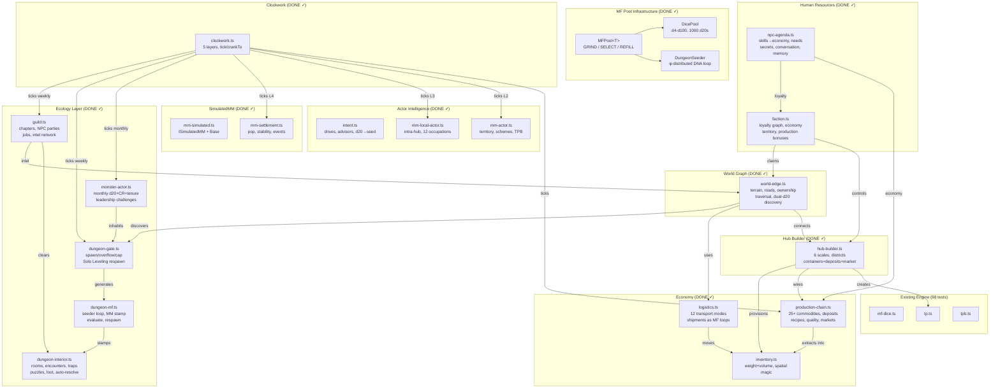

# MF Simulation Strategy — Potential Compute

**Don't simulate the whole world. Pre-compute potential. Resolve on observation.**

## The Prime Loop Insight

From `ml_prime_loop_v2.html`:

```
Each prime spawns a LOOP.
All loops GRIND simultaneously.
Products are REACHABLE.
Gaps are where NEW PRIMES (new information) emerge.

Δp = MFₒ + 2ω   (potential = base + work done)
```

Applied to world simulation:

```
Each MM spawns a TICK LOOP.
When the clockwork turns, loops OVERPRODUCE outcomes.
Store MORE computed results than anyone will ever observe.
When observation happens: SELECT from the pool.
Observation costs NOTHING — the answer is already there.
```

## The Three Phases

### GRIND (on tick — pre-compute MORE than needed)

When the clockwork turns, each MM grinds out computed outcomes:

```
MM_settlement.grind(tickDays):
  // Don't just accumulate a delta — PRE-COMPUTE actual outcomes
  
  // Population: compute 5 branches (low/mid/high/crisis/boom)
  outcomes.population = [
    { branch: 'decline',  pop: base - decay × days,   weight: 0.1 },
    { branch: 'stagnant', pop: base,                   weight: 0.3 },
    { branch: 'stable',   pop: base + growth × days,   weight: 0.4 },
    { branch: 'growing',  pop: base + growth × 2,      weight: 0.15 },
    { branch: 'boom',     pop: base + growth × 4,      weight: 0.05 },
  ]
  
  // Prices: compute full price tables for every commodity
  outcomes.prices = computePriceCurves(supply, demand, days)
  
  // Events: pre-roll 30 possible events, store them ALL
  outcomes.events = Array(30).map(d => rollPossibleEvent(d, state))
  
  // NPCs: pre-compute decision trees for all local NPCs
  outcomes.npcDecisions = npcs.map(n => n.precomputeDecisions(days))
  
  // COST: O(branching × days) but runs ONCE per tick
  // PRODUCES: dozens of ready-to-use outcomes
```

### POOL (storage — outcomes waiting to be observed)

```
outcomePool = {
  suzail: {
    computedAt: worldDay 60,
    population: [5 weighted branches],
    prices: [full commodity table for 30 days],
    events: [30 pre-rolled events with days],
    npcStates: [decision trees for 200 NPCs],
    weather: [seasonal curve, pre-rolled],
    factionMoves: [zhentarim: expand, harpers: investigate],
  },
  waterdeep: { ... },  // same shape
  baldursGate: { ... }, // same shape
  // 100 settlements, all pre-computed, sitting in pool
}
```

### SELECT (on observation — pick from pool, zero compute)

```
Party arrives at Suzail on worldDay 67:

  daysSinceComputed = 67 - 60 = 7
  
  // Population: select branch by weighted random
  actualPop = pool.suzail.population.select(roll)  // O(1)
  
  // Prices: index into pre-computed curve at day 7
  actualPrices = pool.suzail.prices[7]  // O(1)
  
  // Events: filter pre-rolled events for days 60-67
  actualEvents = pool.suzail.events.filter(e => e.day <= 7)  // O(k)
  
  // NPCs: pick from decision tree
  shopkeeper.state = pool.suzail.npcStates['shopkeeper'].atDay(7)  // O(1)
  
  // COST: O(1) — everything was already computed
  // The world was already ALIVE before you looked
```

## Nested Compute — Inner Loops Feed Outer Loops

Like the prime loop where products of P1 feed into P2's grind:

```
CLOCKWORK TICK (weekly):

  1. MM_economy.grind()
     → pre-computes price curves for ALL commodities at ALL settlements
     → produces: pricePool[settlement][commodity][day]
     
  2. MM_faction.grind()
     → reads pricePool to simulate economic interventions
     → pre-computes power shifts across all territories
     → produces: factionPool[faction][territory][day]
     
  3. MM_settlement.grind(pricePool, factionPool)
     → reads BOTH pools to compute settlement outcomes
     → pre-computes population, unrest, events
     → produces: settlementPool[settlement][day]
     
  4. MM_ecology.grind(settlementPool)
     → reads settlement states to compute monster pressure
     → pre-computes population growth, raids, migration
     → produces: ecologyPool[region][species][day]
     
  5. MM_hub.grind(settlementPool, ecologyPool)
     → reads settlement + ecology to compute local events
     → pre-computes NPC schedules, crime, traffic
     → produces: hubPool[hub][day]

  INNER → OUTER
  Economy → Factions → Settlements → Ecology → Hubs
  Each grind CONSUMES from pools above, PRODUCES into its own pool
  Like P1's products feeding P2's multiplication
```

## The Pool Lifecycle

```
Tick 1: GRIND → pool has outcomes for days 1-7
Tick 2: GRIND → pool has outcomes for days 1-14
  (old outcomes still valid, new ones added)
Tick 3: GRIND → pool has outcomes for days 1-21

Party observes at day 18:
  SELECT from pool → outcomes at day 18 already there
  Mark observed outcomes as CONSUMED
  
Tick 4: GRIND → recycles consumed slots
  Pool has outcomes for days 18-28 (fresh from observed state)
  
Party never visits Waterdeep:
  Pool keeps overwriting — old outcomes discarded
  But if they show up on day 200: nearest pool entry selected
  Gap filled with interpolation + event rolls
```


## Overproduction Pools — Concrete Examples

The pattern applies to EVERY computable thing:

```
MF_dice pool: ✓ BUILT
  On tick: pre-roll 1000 d20s, store in pool
  On use:  pop next roll from pool (O(1))
  On tick: from remaining excess, derive 1000 new rolls
  Pool never empties — clockwork refills faster than consumption

MF_dungeon_seeder: ✓ BUILT
  On gate entry: generate seeder loop (φ-distributed DNA)
  Each seed: {layout 0-1, loot 0-1, challenge 0-1, potentialCost}
  stampRoom(): consumes one seed, produces concrete room
  evaluateSeeder(): peek without consuming (guild dispatching)
  respawnSeeder(): gen+1 at 1.2× budgets, same structure
  Seeds sum to 1.0 total potential — dungeon exhausted at 0

MF_events pool:
  On tick: pre-generate 200 possible events per settlement
  On use:  select matching event from pool
  On tick: recycle consumed slots, generate fresh events

MF_npc_decisions pool:
  On tick: pre-compute decision trees for 50 NPCs × 7 days
  On use:  index into tree at current day
  On tick: extend trees forward, prune past

MF_prices pool:
  On tick: pre-compute price curves for 30 commodities × 7 days
  On use:  lookup price at day offset
  On tick: extend curves, adjust from consumed observations

MF_weather pool:
  On tick: pre-compute weather for 30 days (seasonal curve + noise)
  On use:  index into forecast
  On tick: extend forecast forward
```

The key: **consumption NEVER outpaces production.** Each tick overproduces. Excess carries forward. When the clockwork turns, the surplus itself feeds the next grind — like the prime loop where existing products multiply with new primes to generate even more products.

## Potential Formulas per MM

| MM | Potential Δ/tick | Resolve trigger |
|---|---|---|
| MM_economy | `priceΔ = trend × days` | Party checks a market |
| MM_faction | `powerΔ = schemes × days + war × days²` | Party enters faction territory |
| MM_region | `weatherΔ = seasonal curve` | Party travels through region |
| MM_settlement | `popΔ, unrestΔ, prosperityΔ` | Party arrives at settlement |
| MM_ecology | `populationΔ = growthRate × food × days` | Party encounters monsters |
| MM_hub | `trafficΔ, crimeΔ, eventCount` | Party enters district |
| MM_npc | `loyaltyDrift, economicPressure` | Party interacts with NPC |
| MM_guild | `stockpileΔ, membershipΔ` | Party visits guild |
| MM_shop | `revenueΔ = customers × margin × days` | Party enters shop |
| MM_poi | `degradationΔ = decay × days` | Party discovers/enters POI |
| MM_spawner | `populationΔ = spawnRate × days` | Party enters dungeon |
| MM_dungeon | `seeder → stamp → rooms` | Party enters gate | ✓ |
| MM_monster_actor | `d20+CR+tenure → expansion` | Monthly tick | ✓ |
| MM_guild | `parties → traverse → intel` | Weekly tick | ✓ |
| MM_caravan | `positionΔ = speed × days` | Party encounters caravan |

## The Cost Equation

```
Without potential compute:
  N settlements × M NPCs × T days = O(NMT) per world tick
  100 settlements × 200 NPCs × 365 days = 7,300,000 operations/year
  
With potential compute:
  N settlements × O(1) potential + K observed × Δdays
  100 × 1 + 3 observed × 14 days = 142 operations
  
  SAVINGS: 99.998%
```

## Event Generation During Resolve

The "gaps" — things that can't be predicted — are EVENTS:

```
When resolving 30 days of potential:

  // Predictable (delta accumulation):
  population grew by 12
  prices drifted -3%
  unrest increased by 2%
  
  // Unpredictable (roll during resolve):
  Day 8:  merchant guild elected new master
  Day 15: fire in the docks district
  Day 23: zhentarim agent exposed
  
  // These are the PRIMES — genuinely new information
  // that couldn't be computed from known inputs
  // They make the world feel ALIVE when you arrive
```

## Observer Cascade

When the party moves, resolution cascades outward:

```
Party arrives at Suzail:

1. RESOLVE MM_settlement(Suzail)     — immediate
2. RESOLVE MM_hub(current district)   — immediate  
3. RESOLVE MM_npc(visible NPCs)       — immediate
4. POTENTIAL MM_hub(other districts)   — stays lazy
5. POTENTIAL MM_npc(elsewhere)         — stays lazy

Party enters Market Ward:

1. RESOLVE MM_hub(Market Ward)        — now immediate
2. RESOLVE MM_guild(local guilds)     — now immediate
3. RESOLVE MM_shop(visible shops)     — now immediate
4. POTENTIAL MM_hub(Dock Ward)        — still lazy

Party talks to shopkeeper:

1. RESOLVE MM_npc(shopkeeper)         — now immediate
2. Shopkeeper has 30 days of loyalty drift
3. Shopkeeper has events: "lost a shipment Day 12"
4. Shopkeeper's PRICES reflect resolved economy

RIPPLE: always outward from observer, never global
```

## Implementation Shape

```
Every MM gets two methods:

  interface SimulatedMM {
    // Cheap: O(1), runs every tick for ALL instances
    accumulatePotential(daysSinceLastTick: number): void
    
    // Expensive: O(complexity), runs ONLY when observed
    resolve(): ResolveResult
    
    // State
    pendingPotential: PendingDelta
    lastResolved: number  // world day
    isResolved: boolean
  }
```

## Implementation Status (March 12, 2026)

### Full Architecture (528/528 tests passing, 19 test files)



### Files

| File | Purpose | Tests |
|------|---------|-------|
| `engine/mf-pool.ts` | Generic pool: GRIND/SELECT/REFILL | 14 |
| `engine/mf-pool-dice.ts` | DicePool: d20×1000, advantage, tick | 14 |
| `engine/mm-simulated.ts` | ISimulatedMM + SimulatedMMBase | — |
| `engine/mm-settlement.ts` | Settlement: pop, stability, events | 16 |
| `engine/clockwork.ts` | 5-layer tick engine, observe by node | 15 |
| `engine/intent.ts` | Decision engine: drives, d20, initiative | 24 |
| `engine/mm-actor.ts` | Territory actor: schemes, TPB, react | 15 |
| `engine/mm-local-actor.ts` | Local actor: 12 occupations, reputation | 13 |
| `engine/inventory.ts` | Physical inventory: weight+vol, spatial, gems | 37 |
| `engine/logistics.ts` | Transport: 12 modes, shipments, hazards | 20 |
| `engine/production-chain.ts` | Commodities, deposits, recipes, markets | 35 |
| `engine/hub-builder.ts` | Settlement factory: 6 scales, districts | 36 |
| `engine/world-edge.ts` | Routes: terrain, roads, traversal, claims | 34 |
| `engine/faction.ts` | Factions: loyalty graph, economy, territory | 20 |
| `engine/npc-agenda.ts` | NPCs: skills→economy, needs, conversation | 21 |
| `engine/monster-actor.ts` | Monster expansion: monthly d20+CR, challenges | 17 |
| `engine/dungeon-gate.ts` | Gate lifecycle: spawn, overflow, cap, respawn | 17 |
| `engine/dungeon-interior.ts` | Room gen: encounters, traps, puzzles, loot | 22 |
| `engine/dungeon-mf.ts` | MF seeder loop: φ-DNA, stamp, evaluate | 32 |
| `engine/guild.ts` | Guild system: chapters, parties, jobs, intel | 21 |


