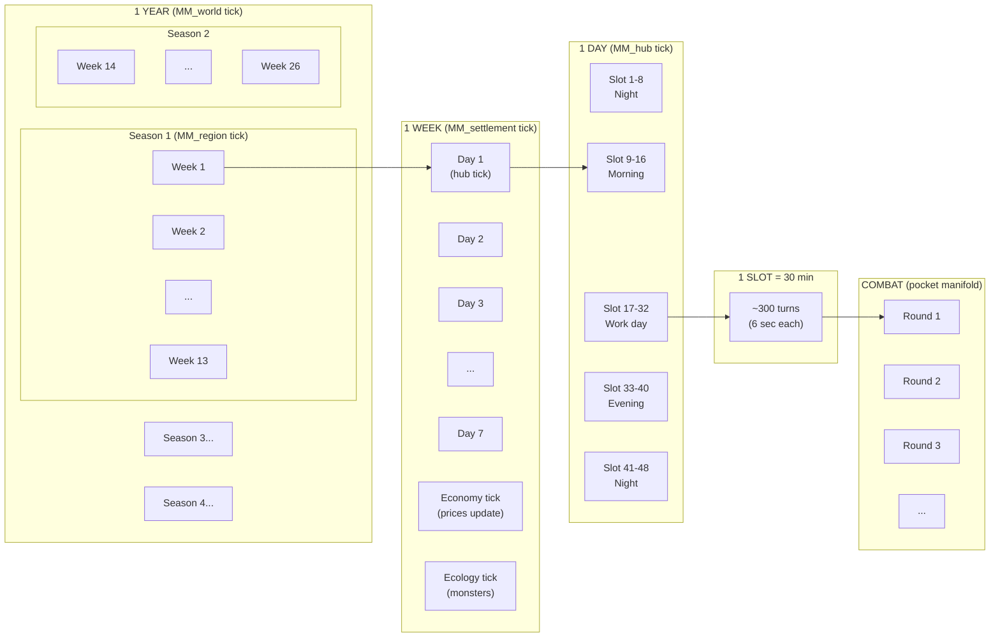

# MM Cycle Ratios — Time as Nesting

**The world simulation is ALWAYS ahead. Players are ALWAYS behind.**

## The Ratio Stack

Each MM tick contains N ticks of the level below it.

```
MM_cosmos       : 1 tick ≈ ∞
                  └── contains ∞ sphere ticks (frozen)

MM_sphere       : 1 tick ≈ 1000 years
                  └── contains 1000 world ticks

MM_world        : 1 tick = 1 year = 365 days
                  └── contains 4 region ticks
                  └── contains 52 economy ticks
                  └── contains 12 faction ticks

MM_faction      : 1 tick = 1 month = 30 days
                  └── contains 4 settlement ticks
                  └── pushes interventions to settlements

MM_economy      : 1 tick = 1 week = 7 days
                  └── reads all settlements
                  └── ticks all caravans (7 × 48 = 336 slots)
                  └── updates prices across world graph

MM_region       : 1 tick = 1 season = 90 days
                  └── contains ~13 settlement ticks
                  └── weather, harvest, migration

MM_settlement   : 1 tick = 1 week = 7 days
                  └── contains 7 hub ticks
                  └── contains ~1 ecology tick
                  └── population, stability, unrest

MM_ecology      : 1 tick = 1 week = 7 days
                  └── spawner output, predation, migration
                  └── affects trade route danger

MM_hub          : 1 tick = 1 day = 24 hours
                  └── contains 48 NPC slots
                  └── NPC schedules, foot traffic, events

MM_npc          : 1 tick = 1 day
                  └── schedule (48 slots of 30 min)
                  └── economic decisions, loyalty drift

MM_caravan      : 1 tick = 1 slot = 30 min
                  └── route progress, cargo, news
                  └── 48 ticks/day, ~336 ticks/week

MM_guild        : 1 tick = 1 week
MM_shop         : 1 tick = 1 week
MM_poi          : 1 tick = 1 week
MM_spawner      : 1 tick = 1 week
```

## The Ratio Table

| Parent | Child | Ratio | Meaning |
|---|---|---|---|
| cosmos | sphere | ∞:1 | Frozen — effectively constant |
| sphere | world | 1000:1 | Millennial — background parameter |
| world | region | 4:1 | 4 seasons per year |
| world | economy | 52:1 | 52 weekly economy ticks per year |
| world | faction | 12:1 | 12 monthly faction ticks per year |
| region | settlement | ~13:1 | ~13 weeks per season |
| settlement | hub | 7:1 | 7 daily hub ticks per week |
| hub | npc | 1:1 | NPC ticks daily with hub |
| hub | npc_slot | 48:1 | 48 half-hour slots per day |
| economy | caravan_slot | 336:1 | 336 slots per week traversal |
| economy | settlement | N:1 | Economy reads ALL settlements |
| faction | settlement | N:1 | Faction controls N territories |

## The Canonical Timeline

```
WORLD SIMULATION (server)
━━━━━━━━━━━━━━━━━━━━━━━━━━━━━━━━━━━━━━━━━━━━━━━━━━━━━▶ T_world
  economy ticks ▪▪▪▪▪▪▪▪▪▪▪▪▪▪▪▪▪▪▪▪▪▪▪▪▪▪▪▪▪▪▪▪▪▪▪▪▪
  faction ticks  ▪    ▪    ▪    ▪    ▪    ▪    ▪    ▪
  region ticks   ▪              ▪              ▪
  NPCs move, trade, breed, scheme, produce, consume...

PLAYER SESSION (always behind)
━━━━━━━━━━━━━━━━━━━━━━━▶ T_session
  Party is at world day 42
  World is at world day 67
  
  Gap = 25 days of simulation the party hasn't "seen"
  
  Session plays out → advances T_session by ~1-3 days
  Between sessions → downtime orders execute
  
  NEVER catches up (world keeps ticking)
  Can FAST TRAVEL (quantum tunnel, skip the gap)
```

## Why Players Are Always Behind

```
REAL TIME          WORLD SIM          PLAYER SESSION
━━━━━━━━━          ━━━━━━━━           ━━━━━━━━━━━━━━
Monday             Day 60             —
Tuesday            Day 61             —
Wednesday          Day 62             Session! (plays Day 42-44)
Thursday           Day 63             —
Friday             Day 64             —
Saturday           Day 65             Session! (plays Day 44-47)
Sunday             Day 66             —
Monday             Day 67             Downtime orders (Day 47-49)

Gap: 67 - 49 = 18 days behind

THE WORLD DOESN'T WAIT.
  - Trade routes ran without them
  - Factions schemed without them
  - Monsters bred without them
  - Prices shifted without them
  - NPCs made decisions without them

WHEN THEY ARRIVE somewhere:
  The world has ALREADY CHANGED since they last saw it.
  This is how you create a living world.
```

## Cycle Nesting Diagram



## What This Means for Implementation

```
World sim runs on SERVER CLOCK:
  - Economy ticks weekly (cron or on-demand batch)
  - Factions tick monthly
  - Regions tick seasonally
  - All async, all ahead of players

Player session is a SNAPSHOT:
  - Session starts → reads world state at T_session
  - Session plays out → local mutations (speculative)
  - Session ends → commits to .tpb, advances T_session
  - Gap between T_session and T_world = "what you missed"

Downtime bridges the gap:
  - Player issues orders during gap days
  - Orders execute against world state
  - Reduces gap but never closes it

Fast travel = skip:
  - "We travel 10 days to Waterdeep"
  - World sim already ran those 10 days
  - Party arrives at current world state
  - No simulation needed — it already happened
```
