# The Complete Nested MM Hierarchy

**System in system. Each level contains the next. Each has its own tick.**

## The Two Trees

The world has **two intersecting trees**: the WORLD simulation (runs whether players exist or not) and the PLAYER observation (how the party sees and interacts with the world). They meet at .tp nodes.

```
WORLD TREE (simulation)              PLAYER TREE (observation)
━━━━━━━━━━━━━━━━━━━━━━               ━━━━━━━━━━━━━━━━━━━━━━━

MM_cosmos                            MM_adventure ✓
└── MM_sphere                        ├── MM_session ✓
    └── MM_world                     │   └── MM_scene (combat) ✓
        ├── MM_economy    ✓          ├── MM_downtime ✓
        ├── MM_faction    ✓          ├── MM_party ✓
        ├── MM_magic (world rules) ✓ │   └── MM_character[] ✓
        ├── MM_social (contracts) ✓  ├── MM_followers ✓
        ├── MM_weather ✓             │   └── MM_npc[] ✓
        ├── MM_region                ├── MM_narrative ✓
        │   └── MM_settlement ✓      │   ├── Arc→Quest→Beat ✓
        │       ├── MM_ecology ✓     │   ├── Rabbit Holes ✓
        │       └── MM_hub    ✓      │   └── Moral Physics ✓
        │           ├── District[]   ├── MM_gm_orchestrator ✓
        │           ├── MM_npc  ✓    │   ├── 4 Play Modes ✓
        │           |   └── Agenda ✓ │   ├── Solo Corridor ✓
        │           ├── MM_guild  ✓  │   └── Clockwork Events ✓
        │           ├── MM_knowledge_pool ✓  └── MM_intelligence ✓
        │           ├── MM_infrastructure ✓      ├── Identity Anchors ✓
        │           ├── MM_husbandry ✓            ├── Knowledge Boundaries ✓
        │           ├── MM_market ✓               └── Memory Protocol ✓
        │           │   ├── Merchants ✓
        │           │   ├── Venues ✓
        │           │   └── Price Discovery ✓
        │           ├── MM_services ✓
        │           │   ├── Providers ✓
        │           │   └── Contracts ✓
        │           └── MM_poi
        │               ├── MM_dungeon ✓
        │               │   ├── MF_seeder (DNA loop) ✓
        │               │   ├── DungeonGate (spawn/overflow) ✓
        │               │   └── DungeonInterior (rooms) ✓
        │               └── MM_spawner
        │                   └── MonsterActor (monthly tick) ✓
        ├── MM_caravan ✓ (physical trade on edges)
        └── MM_edge (routes) ✓
            ├── Segments[]
            ├── Sites[]
            └── Traversal

SYSTEM EDGES (cross-system wires) ✓
━━━━━━━━━━━━━━━━━━━━━━━━━━━━━━━━━━
  Ecology → Husbandry (monster predation)
  Social → Faction (contract loyalty)
  Knowledge → Magic (DC reduction)
  Guild Intel → Faction (reactions)
  Dungeon → Knowledge (civilization flywheel)
  Follower → Combat (profiles)

WORLD TICK ENGINE (orchestrates all of the above) ✓
━━━━━━━━━━━━━━━━━━━━━━━━━━━━━━━━━━━━━━━━━━━━━━━━━
  Daily:   autonomous server tick (all active nodes)
  Weekly:  yield, weather, guild, ecology, market, services
  Monthly: economy, reproduction, social, infrastructure
  Yearly:  faction grand schemes, succession
  Observation: hourly → slot (5m) → round (6s)
```

## What's Actually Built (engine/ — 941 tests, 33 files)

```mermaid
graph TB
  subgraph "IMPLEMENTED ✓"
    direction TB

    subgraph "Player Tree"
      ADV["MM_adventure ✓"]
      SESS["MM_session ✓"]
      SCENE["MM_scene ✓<br/>combat, initiative"]
      CHAR["MM_character ✓<br/>6 abilities, 18 skills<br/>multiclass, spellcasting"]
      PARTY["MM_party ✓"]
      FOLLOW["MM_followers ✓"]
    end

    subgraph "Core Infrastructure"
      TP[".tp ✓<br/>world graph, κ merge"]
      TPB[".tpb ✓<br/>append-only history"]
      DICE["MF_dice ✓<br/>d20 pool (1000)"]
      CLOCK["clockwork.ts ✓<br/>5-layer tick crank"]
    end

    subgraph "Decision Layer"
      INTENT["intent.ts ✓<br/>drives, resources<br/>advisors, d20"]
      ACTOR["mm-actor.ts ✓<br/>territory MM, schemes<br/>TPB life history"]
      LOCAL["mm-local-actor.ts ✓<br/>12 occupations<br/>intra-hub decisions"]
    end

    subgraph "Economy Layer"
      INV["inventory.ts ✓<br/>containers, spatial magic<br/>weight+volume"]
      PROD["production-chain.ts ✓<br/>commodities, deposits<br/>extraction, markets"]
      LOGI["logistics.ts ✓<br/>12 transport modes<br/>shipments, hazards"]
      MARKET["market.ts ✓<br/>merchants, venues<br/>price discovery, haggling"]
      SERV["services.ts ✓<br/>providers, contracts<br/>risk, weekly tick"]
      CARAVAN["caravan.ts ✓<br/>7 transports, cargo<br/>encounters, spoilage"]
    end

    subgraph "Magic Layer"
      MAGIC["magic.ts ✓<br/>4 difficulty tiers<br/>40 prime elements<br/>paradox engine"]
      MABILITY["Monster Abilities ✓<br/>innate spells<br/>recharge mechanics"]
    end

    subgraph "Social Layer"
      SOCIAL["social.ts ✓<br/>30 contract types<br/>households, kinship<br/>titles, jurisdictions"]
    end

    subgraph "Hub Systems"
      KPOOL["knowledge-pool.ts ✓<br/>seeds, potentials<br/>resonance, tiers"]
      INFRA["infrastructure-mm.ts ✓<br/>professions, guilds<br/>tier advancement"]
      HUSB["husbandry.ts ✓<br/>12 species, herds<br/>food sufficiency"]
      WTICK["world-tick.ts ✓<br/>multi-cadence crank<br/>29 standard systems"]
      WEATHER["weather.ts ✓<br/>7 climates × 4 seasons<br/>κ modifiers"]
    end

    subgraph "Settlement Layer"
      HUB["hub-builder.ts ✓<br/>6 scales → outpost..capital<br/>auto-wire all systems"]
      DIST["Districts ✓<br/>8/4 per capital/city<br/>own .tp, κ, containers"]
    end

    subgraph "World Graph"
      EDGE["world-edge.ts ✓<br/>11 terrains, 5 road types<br/>ownership segments"]
      TRAV["Traversal ✓<br/>daily tick, dual-d20<br/>procedural generation"]
      CLAIM["Land Claims ✓<br/>split/merge segments<br/>toll, patrol, upgrade"]
    end

    subgraph "Human Resources"
      FACTION["faction.ts ✓<br/>loyalty graph (-100..+100)<br/>10 types, 7 ranks"]
      FECON["Economic Influence ✓<br/>skill→commodity map<br/>production bonuses"]
      NPC["npc-agenda.ts ✓<br/>18 skills → economy<br/>Maslow needs, secrets"]
      CONV["Conversation ✓<br/>6 approaches × d20<br/>disposition, memory"]
    end

    subgraph "Ecology Layer"
      MONSTER["monster-actor.ts ✓<br/>monthly d20+CR+tenure<br/>leadership challenges"]
      DGATE["dungeon-gate.ts ✓<br/>spawn/overflow/cap<br/>Solo Leveling respawn"]
      DINT["dungeon-interior.ts ✓<br/>rooms, encounters, traps<br/>puzzles, loot, auto-resolve"]
      DMF["dungeon-mf.ts ✓<br/>seeder loop (φ-distributed)<br/>MM stamp, potential cost"]
      GUILD["guild.ts ✓<br/>chapters, NPC parties<br/>jobs, intel network"]
    end

    subgraph "Narrative Layer"
      NARR["narrative.ts ✓<br/>Arc→Quest→Beat<br/>pacing, rabbit holes"]
      MORAL["Moral Physics ✓<br/>villains, patrons<br/>conflicts, alignment"]
    end

    subgraph "GM & Intelligence"
      GM["gm.ts ✓<br/>4 play modes<br/>6 GM profiles<br/>clockwork events"]
      INTEL["intelligence.ts ✓<br/>identity anchors<br/>knowledge boundaries<br/>memory, context"]
      SYSWIRE["system-edges.ts ✓<br/>6 cross-system wires"]
    end
  end

  %% Core connections
  ACTOR --> INTENT
  LOCAL --> INTENT
  HUB --> TP
  HUB --> PROD
  HUB --> INV
  HUB --> DIST
  HUB --> MARKET
  HUB --> SERV
  EDGE --> HUB
  EDGE --> TRAV
  EDGE --> CLAIM
  EDGE --> CARAVAN
  FACTION --> HUB
  FACTION --> EDGE
  FACTION --> FECON
  NPC --> FACTION
  NPC --> CONV
  NPC --> PROD
  LOGI --> INV
  PROD --> INV
  CLOCK --> PROD

  %% Dungeon pipeline
  EDGE -->|"discovers"| DGATE
  DGATE -->|"generates"| DMF
  DMF -->|"stamps"| DINT
  MONSTER -->|"inhabits"| DGATE
  MONSTER -->|"abilities"| MAGIC
  GUILD -->|"clears"| DINT
  GUILD -->|"intel"| EDGE

  %% Hub chains
  KPOOL -->|"unlocks"| INFRA
  INFRA -->|"builds"| HUB
  HUSB -->|"feeds"| HUB
  HUSB -->|"commodities"| PROD
  SOCIAL -->|"governs"| HUB
  SOCIAL -->|"titles control"| TP
  MAGIC -->|"rules per node"| TP
  WEATHER -->|"κ modifiers"| TP
  WTICK -->|"orchestrates"| CLOCK

  %% Narrative/GM/Intelligence
  NARR -->|"structures"| SESS
  GM -->|"generates scenes"| SESS
  GM -->|"reads"| NARR
  INTEL -->|"voices"| NPC
  INTEL -->|"context for"| GM

  %% Cross-system edges
  SYSWIRE -->|"predation"| HUSB
  SYSWIRE -->|"contract→loyalty"| FACTION
  SYSWIRE -->|"knowledge→DC"| MAGIC
  SYSWIRE -->|"dungeon→knowledge"| KPOOL
  SYSWIRE -->|"follower→combat"| SCENE
```



## Nesting Depth Map

```
Region (settlement)
├── .tp node (type: 'settlement')
├── Population (seeded)
├── Scale params (pop, actors, infra, military)
├── Containers[] (treasury, vault, warehouse, granary, chest)
│   ├── Items[] (weight, volume, value)
│   └── Currency (cp/sp/ep/gp/pp)
├── Deposits[] (resource type, quality, labor needs)
│   └── Extractions[] (workers, output → container)
├── Market[] (commodity prices, supply, demand)
├── Districts[] (regional_capital: 8, city: 4)
│   ├── .tp node (type: 'district', parentId: settlement)
│   ├── κ overrides (law enforcement per district)
│   ├── Containers[] (own storage)
│   ├── LocalActorSlots (artisans, merchants, etc.)
│   ├── Market specialization (weapons, fish, etc.)
│   └── NPCs[] (via npc-agenda.ts)
│       ├── SkillBlock (18 skills → production bonuses)
│       ├── MagicCapability (caster?, school, max level)
│       ├── EconomicRole (output commodity, quality%, quantity%)
│       ├── Needs[5] (survival→purpose, Maslow's)
│       ├── Secrets[] (disposition-gated, DC to extract)
│       ├── Opinions (factions, events)
│       ├── Loyalties (faction graph)
│       ├── Dispositions (per entity)
│       └── Memory[] (.tpb — interactions)
├── Factions[] (via faction.ts)
│   ├── Loyalty graph (per faction: -100..+100)
│   ├── Members[] (rank, skill, contribution)
│   │   └── SKILL_COMMODITY_MAP → production bonuses
│   ├── Goals[] (expand, trade, eliminate, etc.)
│   ├── Influence per hub (0-100)
│   ├── Commodity control (price + supply modifiers)
│   ├── Territory (controlled nodes + edge segments)
│   └── Treasury + income/expenses
├── Guilds[] (via guild.ts)                              ✓
│   ├── Chapters (per hub, with job board)
│   ├── NPC Parties (3-5 members, edge traversal)
│   ├── Intel network (travel logs → hub intel)
│   ├── Job matching (rank-gated, reward-scaled)
│   └── Inter-chapter message propagation
├── Knowledge Pool (knowledge-pool.ts)                   ✓
│   ├── Seeds[] (blacksmithing, herbalism, beekeeping...)
│   ├── Potentials[] (unlockable infrastructure)
│   ├── Resonance (population × seed proximity)
│   ├── Tier 0-5 (hub development level)
│   └── Character ascension (knowledge passes to child)
├── Infrastructure (infrastructure-mm.ts)                ✓
│   ├── Buildings[] (forge, temple, inn, market...)
│   ├── Professions[] (unlocked by knowledge tier)
│   ├── Guild formation (when conditions met)
│   └── Monthly settlement evolution tick
├── Husbandry (husbandry.ts)                             ✓
│   ├── 12 species (cattle→rothe, chickens→bees)
│   ├── Herds[] {young, adults, elders, pregnancies}
│   ├── Weekly yield (milk, eggs, wool, manure)
│   ├── Monthly tick (births, deaths, aging, starvation)
│   ├── Slaughter (meat, hide, tallow)
│   ├── Food sufficiency per hub population
│   └── requiredSeed (beekeeping → unlocks bees)
├── Social (social.ts)                                   ✓
│   ├── Contracts[] (30 types across 7 categories)
│   │   ├── Lifecycle: proposed→active→fulfilled/breached
│   │   ├── Visibility: public, private, secret, sacred
│   │   └── Jurisdiction enforcement
│   ├── Households[] (head, heirs, standing, succession)
│   │   ├── Treasury + properties → standing recalc
│   │   └── Succession: heir→eldest child→declining
│   ├── Kinship[] (parent/child/spouse/sibling)
│   │   ├── Legitimacy (legitimate, adopted, contested)
│   │   └── canInherit check
│   ├── Titles[] (emperor→abbot, 8 succession types)
│   │   └── Domain node = .tp territory control
│   └── Ascension continuity (contracts→heir, titles→successor)
├── Magic (magic.ts — rules per .tp node κ)              ✓
│   ├── 4 difficulty tiers (EASY→BRUTAL)
│   │   └── κ.magic.difficulty at node determines tier
│   ├── 40 prime-encoded spell elements
│   │   └── Spell seed = product of primes (universal)
│   ├── Paradox engine (entropy accumulation + d100 check)
│   │   └── 4 severity tiers → backlash effects
│   ├── Monster abilities = innate spells
│   │   ├── Dragon breath = Fire³ × Cone × Instant × Greater
│   │   ├── Recharge mechanics (at_will, X/day, recharge_5_6)
│   │   └── Composition round-trips with factorizeSpell()
│   └── Cast resolution (slots, lore gates, blood magic)
├── Ecology (monster-actor.ts, dungeon-gate.ts)          ✓
│   ├── MonsterActor (monthly tick: d20+CR+tenure)
│   │   ├── Leadership challenges (loser migrates)
│   │   ├── Expansion actions (hunt, raid, fortify, recruit)
│   │   ├── Food security, troops, danger radius
│   │   └── Migration → seeds new lair on random edge
│   └── DungeonGate (weekly tick)
│       ├── Tier (1-5), type (ruin, lair, portal, corruption)
│       ├── Spawn rate, spillover threshold
│       ├── Overflow → danger radius grows
│       ├── Leader emergence (4+ weeks overflow)
│       ├── Clear/cap mechanics
│       └── Solo Leveling respawn (1.2× per generation)
├── DungeonInterior (dungeon-interior.ts)                ✓
│   ├── Room generation (entrance → boss)
│   │   ├── Encounters (species, CR, behavior, avoidability)
│   │   ├── Traps (10 types, detect/disarm DC, damage)
│   │   ├── Puzzles (6 categories, bypass DC, rewards)
│   │   └── Loot (items by rarity, GP value, hidden/trapped)
│   ├── NPC auto-resolve (room-by-room d20 resolution)
│   ├── Full dungeon resolution (aggregate casualty + loot)
│   └── Boss budget reservation (40% of encounter CR)
├── DungeonSeeder (dungeon-mf.ts — MF pattern)           ✓
│   ├── Seeder loop: [{layout, loot, challenge, potentialCost}]
│   ├── φ-distributed layout (no room type clustering)
│   ├── Quadratic potential curve (boss costs 3× entrance)
│   ├── stampRoom() — consumes potential, produces room
│   ├── evaluateSeeder() — peek without consuming
│   └── respawnSeeder() — gen+1 at 1.2× budgets
├── Actors (mm-actor.ts — territory-level decisions)
│   ├── Drives (survival, power, wealth, ideology)
│   ├── Schemes[] (active plans with TPB history)
│   └── MF pools (d20 for intent resolution)
└── LocalActors (mm-local-actor.ts — intra-hub)
    ├── 12 occupations (merchant→spy)
    └── Actions (buy, sell, recruit, sabotage, etc.)

Routes (world-edge.ts)
├── Distance (miles, known for Toril)
├── Terrain (11 types: plains→underground)
│   ├── Speed modifier (1.0..0.25)
│   └── Resource table (what spawns here)
├── Segments[] (ownership slices)
│   ├── Controller (faction/player/unclaimed)
│   ├── Road condition (none→paved, speed mod)
│   ├── Danger level (safe→deadly, from patrol density)
│   └── Toll (GP per traveler)
├── DiscoveredSites[] (procedural, dual-d20 system)
│   ├── resource_deposit (rich/standard), ruin (dungeon seed)
│   ├── monster_lair (spawner seed), camp_site, crossing
│   ├── landmark, shrine, settlement_seed
│   └── Dungeons + lairs now spawn at 15% of traversals ← FIXED ✓
├── Traversal state (daily tick)
│   ├── Mile position, direction, speed
│   ├── Segment transitions (toll collection)
│   └── Discovery rolls (d20Seed + typeD20)
└── Fast travel (gated: must traverse first)
    └── teleportation_circle | portal | known_route
```

## Tick Rate Table

| Level | MM | Tick | Contains | Status |
|---|---|---|---|---|
| Cosmological | MM_cosmos | ~∞ | spheres | ○ |
| Cosmological | MM_sphere | millennia | worlds | ○ |
| Geological | MM_world | year | economy, factions, regions | ○ |
| Geological | MM_economy | week | extraction, logistics, prices | **partial** ✓ |
| Geological | MM_faction | month | loyalty, territory, economy | **done** ✓ |
| Geological | MM_region | season | settlements | ○ |
| Civilization | MM_settlement | week | ecology, hubs, districts | **done** ✓ |
| Civilization | MM_ecology | month | monster actors, dungeons, spawners | **done** ✓ |
| Local | MM_hub | day | districts, NPCs, POIs | **done** ✓ |
| Local | MM_guild | week | chapters, parties, jobs, intel | **done** ✓ |
| Local | MM_knowledge | monthly | seeds, potentials, resonance, tier | **done** ✓ |
| Local | MM_infrastructure | monthly | professions, guilds, buildings, tier | **done** ✓ |
| Local | MM_husbandry | weekly yield, monthly repro | herds, food sufficiency | **done** ✓ |
| Local | MM_social | monthly + on event | contracts, households, titles | **done** ✓ |
| Local | MM_magic | per cast + per node | difficulty, paradox, abilities | **done** ✓ |
| Local | MM_market | week | merchants, venues, prices, haggling | **done** ✓ |
| Local | MM_services | week | providers, contracts, risk | **done** ✓ |
| Local | MM_shop | week | revenue, stock | ○ |
| Local | MM_poi | week | degradation, spawner | ○ |
| Local | MM_dungeon | weekly gate + on-entry | rooms, encounters, seeder | **done** ✓ |
| Individual | MM_npc | day | agenda, needs, economy, memory | **done** ✓ |
| Individual | MM_monster_actor | month | expansion, challenges, migration | **done** ✓ |
| Individual | MM_caravan | daily | transport, cargo, encounters, spoilage | **done** ✓ |
| Route | MM_edge | day | traversal, discovery, claims | **done** ✓ |
| Orchestrator | MM_world_tick | daily (base) | delta counting, observation triggers | **done** ✓ |
| Orchestrator | MM_weather | weekly | 7 climates, κ modifiers | **done** ✓ |
| Orchestrator | MM_system_edges | on event | 6 cross-system wires | **done** ✓ |
| Player | MM_adventure | day | sessions, downtimes | **done** ✓ |
| Player | MM_session | card | scenes, hooks | **done** ✓ |
| Player | MM_scene | round | combat | **done** ✓ |
| Player | MM_character | — | abilities, HP, skills | **done** ✓ |
| Player | MM_party | — | characters | **done** ✓ |
| Player | MM_followers | — | NPC companions | **done** ✓ |
| Player | MM_narrative | — | arcs, quests, beats, depth, moral physics | **done** ✓ |
| Player | MM_gm | per scene | 4 play modes, GM profiles, scene gen | **done** ✓ |
| Player | MM_intelligence | per agent | identity, knowledge, memory, context | **done** ✓ |

## MF Loops (Seeder/Pool Infrastructure)

| MF | Pattern | Tick | Status |
|---|---|---|---|
| MF_dice | Pool: 1000 d20s, pop on use | per use | **done** ✓ |
| MF_pool | Generic GRIND/SELECT/REFILL | varies | **done** ✓ |
| MF_dungeon_seeder | DNA loop: {layout, loot, challenge} | on-entry | **done** ✓ |
| MF_weather | Climate×season matrix + d100, κ modifiers | weekly | **done** ✓ (weather.ts) |
| MF_prices | Pre-compute price curves | weekly | ○ (market.ts has static pricing, not MF pool) |
| MF_events | Pre-generate possible events | weekly | ○ (clockwork events in gm.ts, not MF pool) |
| MF_npc_decisions | Decision tree pre-compute | weekly | ○ (npc-agenda has tick, not MF pool) |

## The Scale Threshold Rule

```
ALWAYS .tp (topological):
  Crystal sphere, planet, continent, region, settlement, district, building
  Significant entities (Elminster, Vangerdahast)
  Resource deposits (Ironforge Vein)
  Trade routes (edges with segments)       ← BUILT ✓
  Dungeons/POIs (nodes with spawners)      ← BUILT ✓

ALWAYS MM (manifold):
  Individual NPCs (with agenda + economy)  ← BUILT ✓
  Caravans/traversals                    ← BUILT ✓
  Player characters
  Combat encounters (pocket manifolds)
  Monster actors (monthly expansion)       ← BUILT ✓

ALWAYS MF (marble frame / loop):
  Dungeon seeder (φ-distributed DNA)       ← BUILT ✓
  Dice pools (pre-rolled d20s)             ← BUILT ✓
  Price curves (pre-computed)
  Weather generation (climate×season)      ← BUILT ✓

HYBRID (.tp + MM):
  Factions (territory = .tp, behavior = MM)  ← BUILT ✓
  Guilds (jurisdiction = .tp, economics = MM) ← BUILT ✓
  Settlements (node = .tp, simulation = MM)  ← BUILT ✓
  Districts (child .tp, own κ + containers)  ← BUILT ✓
  Monster populations (range = .tp, ecology = MM) ← BUILT ✓
  Dungeon gates (node = .tp, interior = MF stamp) ← BUILT ✓
  Magic (rules = .tp κ, caster state = MM)   ← BUILT ✓
  Husbandry (climate/terrain = .tp, herds = MM) ← BUILT ✓
  Social (jurisdiction = .tp, contracts = MM) ← BUILT ✓
  Knowledge (hub node = .tp, seeds/tiers = MM) ← BUILT ✓
  Infrastructure (settlement = .tp, buildings = MM) ← BUILT ✓
  Titles (domain = .tp node, holder = MM)    ← BUILT ✓
  Weather (region = .tp κ, generation = MM)  ← BUILT ✓
  Markets (hub = .tp, merchants = MM)        ← BUILT ✓
  Services (hub = .tp, providers = MM)       ← BUILT ✓
  Narrative (adventure = .tp, arcs = MM)     ← BUILT ✓
  Intelligence (agent = .tp, context = MM)   ← BUILT ✓
```

## Dungeon Pipeline (NEW)

```
Edge traversal (daily tick)
  │ dual-d20: gateRoll + typeRoll
  │ ruin → dungeon seed (10%)
  │ monster_lair → spawner seed (10%)
  ▼
DungeonGate (weekly tick)
  │ activate from discovered site
  │ spawn monsters (spawnRate per week)
  │ overflow if currentInternal > threshold
  │ leader emerges after 4+ weeks overflow
  ▼
MF_dungeon_seeder (on party entry)
  │ generateSeeder(gateId, tier, type, species, gen, d20)
  │ → [{layout, loot, challenge, potentialCost}, ...]
  │ evaluateSeeder() → guild peeks at difficulty
  │ stampAll() → concrete rooms
  ▼
DungeonInterior (room-by-room)
  │ entrance → corridors → chambers → boss
  │ encounters (species, CR, behavior)
  │ traps (10 types, detect/disarm/damage)
  │ puzzles (6 categories, bypass DC)
  │ loot (rarity, GP, hidden/trapped)
  ▼
Resolution
  ├── NPC party: auto-resolve room-by-room (d20)
  │   └── casualties, loot collected, partial fail
  └── Player party: full interactive experience
      └── puzzle builder (bend/src/engine/puzzle/)
```

## Key Insights

> The world tree runs even when no one is playing. The player tree only runs during sessions/downtime. They intersect at .tp nodes — the party's position in the world.
>
> **NPCs are not decoration.** Each NPC's skill block feeds production bonuses into their hub's economy. Lose your master blacksmith (athletics +7) and weapon quality drops 14%. Hire away a rival's alchemist and suddenly you have potions. Move a faction's merchant network (persuasion +5 each) into your hub and watch prices shift. People ARE the economy.
>
> **Dungeons are not static.** Gates spawn, overflow, and evolve. Monster actors expand monthly. NPC parties attempt clears. Failed clears feed the director-engine's evolution cycle. The dungeon seeder's MF loop means the same gate produces the same rooms deterministically — but respawned dungeons are 1.2× harder each time.
>
> **Food drives growth.** Husbandry yields → economy commodities → household treasury → standing → infrastructure tier. A settlement can't grow past its food supply. Bees require a `beekeeping` knowledge seed. This is why knowledge pool → infrastructure → husbandry form a tight loop.
>
> **Magic has consequences.** HARD mode means lore gates, entropy accumulation, and paradox. A catastrophic paradox creates a permanent `wild_zone` on the .tp node — future casts there auto-trigger wild magic. Monster abilities ARE spells (same prime composition), so a dragon's breath and a wizard's fireball live in the same math.
>
> **Contracts are the social graph.** Marriage binds households. Vassalage controls territory. Debts survive character death (pass to heir). When a character ascends (becomes topological), their entire social web transfers or collapses. This is how generational play works — the social engine persists across character lifetimes.
>
> **Four ways to play, one engine.** GROUP_DM_AI: human DM creates, AI assists. GROUP_AI: AI generates scenes from world state. SOLO_AI: AI weaves a personal narrative with corridor progression. TRUE_SOLO: pure clockwork — no AI at all, world-tick + npc-agenda generate events from faction conflicts, weather, and ecology. The GM orchestrator routes behavior; the intelligence layer gives each NPC a bounded consciousness (what they know ≠ what exists).
>
> **AI agents are NOT omniscient.** The blacksmith knows local gossip and weapon quality, not the dragon attack three towns over. Knowledge boundaries (6 scopes: personal, witnessed, location, faction, world, party) prevent AI from leaking information the NPC wouldn't know. Memories decay over time — emotional memories last longest. Context budgeting fits identity + knowledge + situation + goals into a token budget by priority.
>
> **The schema IS the topology.** Every table IS a .tp node type. Every row IS a .tpb entry. The database schema literally IS the world graph — 54 tables across 9 layers, connected by foreign keys that mirror the MM nesting hierarchy. When you query the database, you're walking the world graph.
