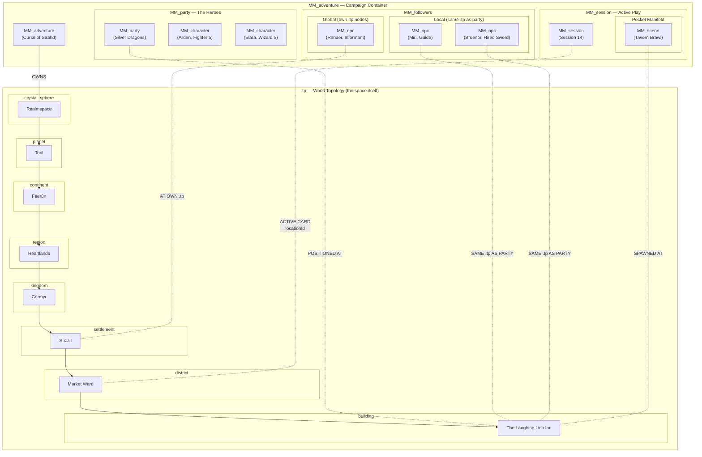
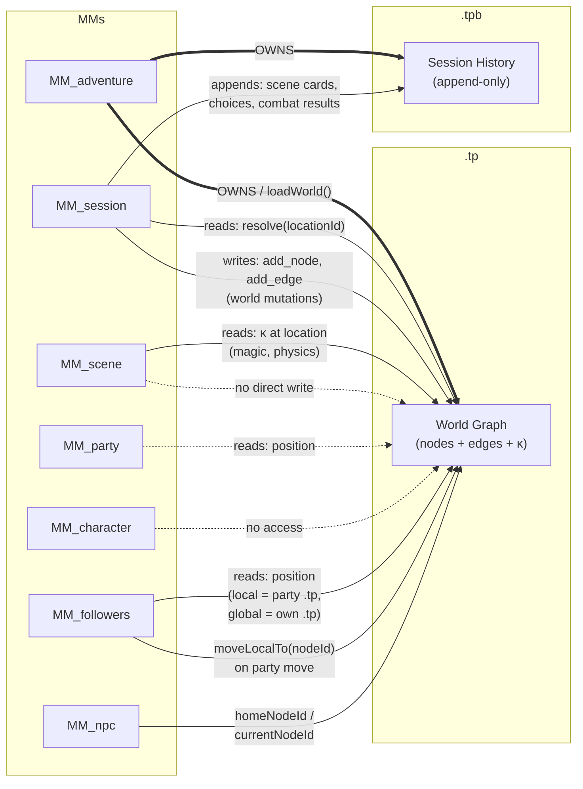
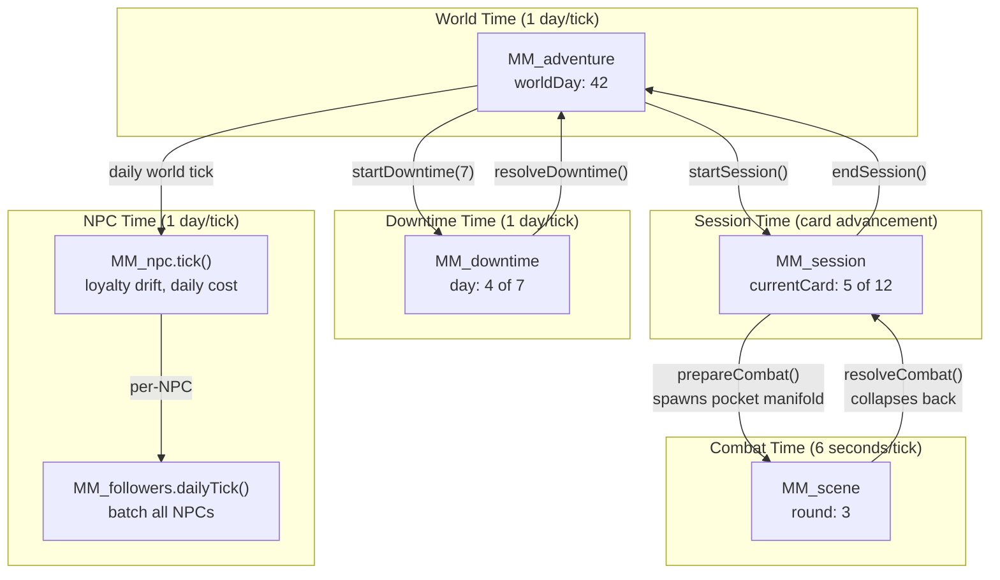
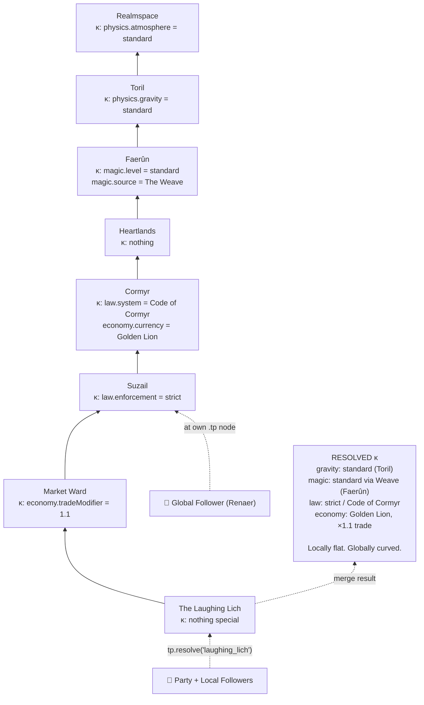
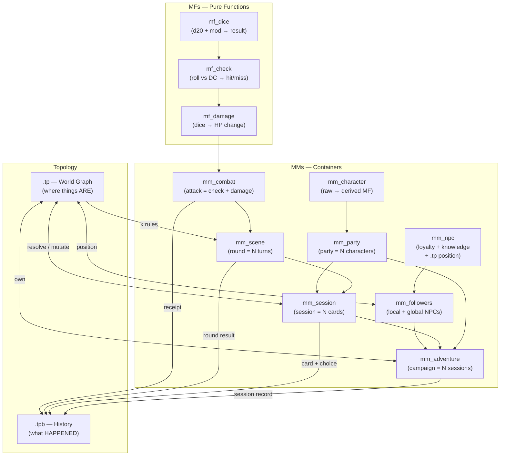

# MM ↔ TP Topology Schema

How every Manifold Machine interacts with the Topology Pointer (.tp).

## Scale Threshold — What IS .tp vs what LIVES AT .tp

```
TOPOLOGICAL (IS a .tp node):        MANIFOLD (lives AT a .tp node):
  Elminster (too big, warps space)    Hired Guide (regular NPC)
  The Weave (fundamental force)       Tavern Keeper (commoner)
  Mount Hotenow (landmark)            City Guard (faction member)
  Zhentarim HQ (faction seat)         Shopkeeper (merchant)
  Suzail (settlement)                 Party follower

  Factions = BOTH — .tp (territory) + MM (behavior)
```

## 1. Containment — What Lives Where



## 2. Read/Write — How MMs Touch .tp



## 3. Time Dilation — Tick Rates at Each Level



## 4. κ Resolution — The Planar Anchor



## 5. Data Flow — From MF to .tpb



## 6. Complete File Map

| File | Type | Lines | .tp Access | .tpb Access | Contains |
|---|---|---|---|---|---|
| [types.ts](file:///D:/-ttrpg-engine/engine/types.ts) | Foundation | 165 | — | — | CycleDelta, Receipt, ZERO_DELTA |
| [mf-dice.ts](file:///D:/-ttrpg-engine/engine/mf-dice.ts) | MF | 189 | — | — | d20 resolution, deterministic seed |
| [mf-check.ts](file:///D:/-ttrpg-engine/engine/mf-check.ts) | MF | 263 | — | — | Skill/save/attack rolls vs DC |
| [mf-damage.ts](file:///D:/-ttrpg-engine/engine/mf-damage.ts) | MF | 256 | — | — | Damage dice + resistance/vulnerability |
| [mm-combat.ts](file:///D:/-ttrpg-engine/engine/mm-combat.ts) | MM | 303 | — | — | Attack = check + damage pipeline |
| [mm-character.ts](file:///D:/-ttrpg-engine/engine/mm-character.ts) | MM | 472 | — | — | Raw→derived MF, state transitions |
| [mm-npc.ts](file:///D:/-ttrpg-engine/engine/mm-npc.ts) | MM | 482 | **position** | — | NPC: loyalty, disposition, knowledge, .tp |
| [mm-party.ts](file:///D:/-ttrpg-engine/engine/mm-party.ts) | MM | 282 | read | — | Roster, gold, rest orchestration |
| [mm-followers.ts](file:///D:/-ttrpg-engine/engine/mm-followers.ts) | MM | 300 | **read+move** | — | Local + global NPC container |
| [mm-scene.ts](file:///D:/-ttrpg-engine/engine/mm-scene.ts) | MM | 478 | read κ | write | Combat rounds (6s tick pocket) |
| [mm-session.ts](file:///D:/-ttrpg-engine/engine/mm-session.ts) | MM | 611 | **read+write** | write | Scene cards, hooks, combat prep |
| [mm-adventure.ts](file:///D:/-ttrpg-engine/engine/mm-adventure.ts) | MM | 420 | **owns** | owns | Campaign, party, followers, world time |
| [tp.ts](file:///D:/-ttrpg-engine/engine/tp.ts) | TP | 383 | **IS** | — | World graph, κ resolution |
| [tpb.ts](file:///D:/-ttrpg-engine/engine/tpb.ts) | TPB | 231 | — | **IS** | Append-only history, branch/diff |

## Key Insight

> **.tp is the box.** MMs live inside .tp nodes.
>
> **Scale threshold:** Regular NPCs are MMs placed at .tp nodes. Significant entities (Elminster, The Weave) ARE .tp nodes — they're too big to not be topological. Factions are **both**: .tp for territory, MM for behavior.
>
> **Local followers** share the party's .tp node — they move when the party moves, fight when the party fights. **Global followers** sit at their own .tp nodes — their knowledge is gated by their position, not the party's.
>
> When combat starts, a **pocket manifold** spawns. Local followers join as combatants. When combat ends, the pocket collapses back into the session.
