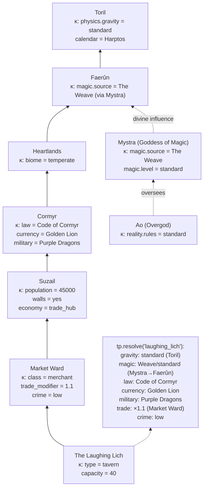

# .tp Topology Map — What IS the Space

**Topology comes first. Everything else is placed IN topology.**

## .tp Node Types

```
COSMOLOGICAL
  ├── multiverse          ← κ: fundamental constants
  ├── plane               ← κ: planar traits (fire, shadow, astral)
  ├── deity               ← κ: divine domain, portfolio, edicts
  ├── crystal_sphere      ← κ: spelljammer physics, void rules
  └── celestial_body      ← κ: gravity, atmosphere, rotation

GEOGRAPHICAL
  ├── continent           ← κ: tectonic, climate zone
  ├── ocean               ← κ: currents, depth, navigation
  ├── region              ← κ: biome, weather patterns, natural hazards
  └── landmark            ← κ: unique features (The Weave, Mount Hotenow)

POLITICAL
  ├── kingdom             ← κ: law system, currency, military doctrine
  ├── province            ← κ: local governance, tax rates
  └── territory           ← κ: faction control, contested/stable

SETTLEMENT
  ├── city                ← κ: population, walls, economy type
  ├── town                ← κ: trade connections, militia
  ├── village             ← κ: subsistence, vulnerability
  ├── outpost             ← κ: purpose (military, trade, religious)
  └── ruin                ← κ: former purpose, hazard level, loot potential

LOCAL (hub-level)
  ├── district            ← κ: socioeconomic class, crime, foot traffic
  ├── building            ← κ: purpose, capacity, owner
  ├── room                ← κ: contents, lighting, access
  └── dungeon_level       ← κ: depth, spawner, hazard tier

EDGES (connections between nodes)
  ├── road                ← κ: condition, patrol, toll
  ├── trade_route         ← κ: capacity, danger, distance, terrain
  ├── river               ← κ: navigable, direction, seasonal
  ├── portal              ← κ: destination, stable/unstable, key
  ├── sea_lane            ← κ: wind, pirates, distance
  └── divine_connection   ← κ: prayer channel, domain conduit
```

## Scale Threshold — What Becomes .tp

```
TOO BIG to be MM → it IS the space:

  GODS are .tp
    Mystra IS The Weave node
    Ao IS the multiverse oversight node
    Kelemvor IS the Fugue Plane node
    Their κ: divine portfolio, edicts, domain rules

  SIGNIFICANT ENTITIES are .tp
    Elminster IS a node (warps magic around him)
    The Weave IS a node (fundamental force)
    Strahd IS Barovia (domain = prison)
    Their κ: personal power, influence radius, lore

  RESOURCE DEPOSITS are .tp
    Ironforge Vein IS a node (extractable)
    Darkwood Forest IS a node (renewable)
    Ley Line IS a node (magical source)
    Their κ: deposit type, quality, reserves, hazards

  FACTIONS have .tp presence
    Zhentarim HQ IS a node
    Purple Dragon garrison IS a node per settlement
    Harpers safehouse IS a hidden node
    Their κ: territory control, enforcement, resources

  DUNGEONS are .tp
    Undermountain IS a node tree (levels)
    Goblin Warren IS a node
    Their κ: spawner, degradation, loot tier
```

## κ Inheritance — The Merge Walk



## Divine Topology

Gods are .tp nodes connected to the planes they inhabit and the domains they control:

```
plane:astral
├── deity:ao (κ: oversees all, no direct worship)
│
plane:elysium
├── deity:lathander (κ: domain=renewal/dawn, edicts=hope)
│
plane:limbo
├── deity:tempus (κ: domain=war, edicts=honorable combat)
│
plane:mechanus
├── deity:mystra (κ: domain=magic, edicts=preserve the Weave)
│   └── feature:the_weave (κ: magic.level=standard)
│       └── [divine_connection edges to every material plane node]
│
plane:fugue
├── deity:kelemvor (κ: domain=death, edicts=no undead)
│
plane:shadowfell
├── domain:barovia
│   └── deity_like:strahd (κ: domain=domain_lord, trapped)
```

## Edge Types and What They Carry

| Edge Type | κ Properties | Examples |
|---|---|---|
| road | condition, patrol, toll, terrain | Suzail→Arabel highway |
| trade_route | capacity, danger, distance, goods | The Iron Road |
| river | navigable, direction, seasonal | River Chionthar |
| sea_lane | wind, pirates, distance | Sword Coast shipping |
| portal | destination, stable, key, cost | Undermountain gates |
| divine_connection | domain, strength, prayer | Mystra→Weave→everywhere |
| faction_presence | control%, enforcement, agents | Zhentarim in Westgate |
| ley_line | magic_boost, instability | Myth Drannor nexus |

## Topology First, Then MMs

```
1. .tp defines WHERE things can exist
2. κ at each node defines WHAT RULES apply there
3. MMs are PLACED at .tp nodes
4. MMs READ κ to know what rules apply
5. MMs WRITE κ when they change the world
6. Party OBSERVES .tp through their current node

The topology IS the world.
The MMs are the life in it.
```

## Module-to-Topology Mapping

Every engine module reads or writes .tp. Here's how they connect:

### Magic → .tp

```
.tp node κ carries:
  magic.difficulty    = EASY | NORMAL | HARD | BRUTAL
  magic.source        = weave | shadow_weave | primal | none
  magic.ley_line      = true/false (entropy risk bonus)
  magic.wild_zone     = true/false (auto wild-magic on cast)
  magic.forbidden[]   = [necromancy, conjuration] (banned schools)

How magic uses .tp:
  READS  κ.magic.difficulty → which MagicConfig applies
  READS  κ.magic.ley_line   → entropy risk modifier
  READS  κ.biome            → biome-locked spells check this
  WRITES κ.magic.wild_zone  → paradox catastrophe creates reality scars
  WRITES κ.magic.forbidden  → excommunication bans schools in jurisdiction

Monster abilities are magic:
  Dragon at .tp node  → breath weapon = Fire³ × Cone × Instant × Greater
  Beholder in dungeon → eye rays = innate spells, no slots
  Spell seeds are universal — same prime product everywhere
```

### Husbandry → .tp

```
.tp node κ carries:
  husbandry.herds[]       = [{speciesId, count}]
  husbandry.pasture_sqft  = available grazing space
  husbandry.feed_supply   = current stored feed (lbs)
  husbandry.food_surplus  = population_feedable - population

How husbandry uses .tp:
  READS  κ.climate          → which species can live here
  READS  κ.terrain          → terrain-adapted species thrive
  READS  κ.biome            → pasture quality
  READS  edge.trade_route   → feed imports when local supply short
  WRITES κ.food_surplus     → infrastructure-mm checks this for growth
  WRITES κ.economy.commodities += meat, milk, eggs, wool, hide

Tick cadence:
  Weekly:  yield tick (milk, eggs, wool, manure per herd)
  Monthly: reproduction, mortality, aging, starvation check
           food sufficiency recalc for hub population
```

### Social → .tp

```
.tp node κ carries:
  social.jurisdiction   = which jurisdiction governs this node
  social.law_system     = inherited from kingdom/province κ
  social.households[]   = households headquartered here
  social.titles[]       = titles whose domain IS this node

How social uses .tp:
  READS  κ.law_system       → contract enforcement rules
  READS  κ.faction_presence → who can witness/ratify contracts
  WRITES κ.social.standing  → household wealth affects district class
  WRITES κ.territory        → title holders control nodes

Contract visibility follows .tp:
  public   → visible to all nodes in jurisdiction scope
  private  → visible at contract node + party nodes
  secret   → visible only to party nodes
  sacred   → visible to deity node + party nodes via divine_connection

Ascension (character becomes .tp):
  contracts transfer to heir or terminate
  titles pass via succession rules
  household continues or declines
  debts become household-level obligations
```

### Knowledge Pool → .tp

```
.tp node κ carries:
  knowledge.seeds[]     = active knowledge seeds at this hub
  knowledge.potential[] = unlockable infrastructure potentials
  knowledge.tier        = 0-5 (hub development tier)

How knowledge uses .tp:
  READS  κ.population       → more people = more resonance
  READS  κ.faction_presence → factions deposit knowledge seeds
  WRITES κ.knowledge.tier   → triggers infrastructure upgrades
  WRITES κ.professions[]    → new professions available at hub
  WRITES κ.guilds[]         → guilds form when conditions met
```

### Infrastructure → .tp

```
.tp node κ carries:
  infra.buildings[]     = constructed buildings at node
  infra.workshops[]     = active production workshops
  infra.tier            = settlement development level
  infra.population      = current population

How infrastructure uses .tp:
  READS  κ.knowledge.tier   → what can be built
  READS  κ.husbandry.food   → population growth requires food
  READS  κ.economy          → construction costs, resource availability
  WRITES κ.infra.buildings  → new buildings change node capacity
  WRITES κ.population       → tier-ups allow population growth
  WRITES edge.trade_route   → new trade connections at high tiers
```

### World Tick → .tp

```
Tick cadence WHERE:
  Daily:   all active .tp nodes (server-side, autonomous)
  Weekly:  hub-level nodes (yield, weather)
  Monthly: settlement+ nodes (economy, reproduction, social)
  Yearly:  kingdom+ nodes (faction schemes, succession)

  Observation ticks (player-present):
    Hourly:  encounter checks, NPC schedules
    Slot:    5-minute exploration turns
    Round:   6-second combat turns

  Potential optimization:
    Hub at max potential → SKIP tick (nothing to compute)
    Hub unobserved → daily tick only (no observation ticks)
    Hub observed → full tick stack
```

### Economy & Markets → .tp

```
.tp node κ carries:
  economy.market_type   = none | barter | market | trade_hub
  economy.commodities   = {meat: 500, grain: 2000, iron: 100}
  economy.prices        = difficulty-adjusted from supply/demand
  economy.trade_balance  = imports - exports

How economy uses .tp:
  READS  edge.trade_route.capacity → max goods flowing per tick
  READS  κ.husbandry.surplus       → local food production
  READS  κ.infra.workshops         → manufactured goods output
  READS  κ.social.guild_membership → merchant guild price mods
  WRITES κ.economy.prices          → supply/demand recalculation
  WRITES κ.economy.commodities     → production adds, consumption removes

Trade flows ALONG edges:
  surplus at node A → trade_route edge → deficit at node B
  edge κ.danger modifies caravan success rate
  edge κ.toll modifies profit margin
```

### Faction → .tp

```
.tp node κ carries:
  faction.control[]     = [{factionId, strength%}]
  faction.law           = dominant faction sets law_system
  faction.agents        = faction NPCs present at node

How faction uses .tp:
  READS  κ.social.titles    → titled characters control nodes
  READS  κ.economy          → wealthy nodes are worth contesting
  READS  edge.faction_presence → influence spreads along edges
  WRITES κ.faction.control  → territory changes after conflict
  WRITES κ.law_system       → new ruler changes laws
  WRITES edge.patrol        → faction patrols roads they control
```

## Hub: Where Everything Meets

A hub (.tp settlement node) is where ALL modules converge:

```
hub:winterhaven
  κ resolved from parent walk:
    gravity: standard (Toril)
    magic: HARD (Faerûn default)
    law: Lord's Alliance charter
    climate: temperate
    biome: woodland_edge

  Modules active at this hub:
    ├── knowledge-pool   → tier 2, seeds: [blacksmithing, herbalism]
    ├── infrastructure   → forge, temple, inn, market stall
    ├── husbandry        → cattle(12), chickens(40) → feeds 25 people
    ├── social           → 8 households, Baron title, village jurisdiction
    ├── economy          → barter market, trades along East Road edge
    ├── faction           → Lord's Alliance 80%, Zhentarim 15% (covert)
    ├── magic            → HARD difficulty, no ley line, no bans
    └── world-tick       → daily autonomous, monthly infrastructure

  Food chain:
    husbandry.yields → economy.commodities
    economy.prices → social.household.treasury
    social.standing → infrastructure.tier_requirements
    infrastructure.tier → knowledge.unlock_potential
    knowledge.seeds → husbandry.requiredSeed (beekeeping unlocks bees)
```
