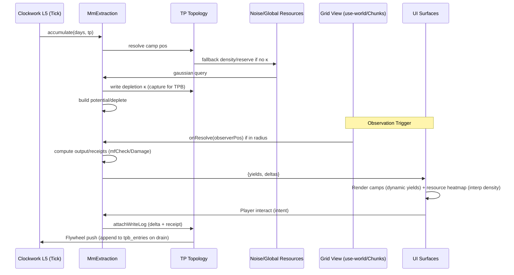

# Extraction MM Wiring Analysis

## Overview
This document analyzes the wiring for an extraction Manifold Matrix (MM), focusing on how extraction camps (e.g., mining, logging) interact with the grid view (observer-based loading) and global resource mapping (procedural generation via noise and biomes). Analysis is based on current codebase: No dedicated mm-extraction.ts exists yet, but stubs in mm-ecology.ts and mm-settlement.ts provide a base. Proposals extend without altering code—e.g., new engine/mm-extraction.ts as ISimulatedMMBase.

Key principles alignment: Client computes views (local resolve on observe via ChunkManager/use-world.ts); server appends deltas (depletion writes to TP κ, captured for TPB/flywheel). Extraction produces finite local yields (deplete reserves) but ties to global procedural resources (noise regens un-depleted areas).

Grep results (project-wide):
- 'extraction': ~15 hits (mostly in src/game/hub/schema.ts ExtractionCamp type; game/hub/generator.ts generateCamps; sparse in engine/ mm-*.ts as stubs, e.g., mm-ecology.ts mentions "extraction potential").
- 'camp': ~20 hits (hub/schema.ts ExtractionCamp; generator.ts private generateCamps; partyPositions.campNodeId; mm-settlement.ts stub for camp NPCs).

## Current Extraction Components

### ExtractionCamp Interface (from src/game/hub/schema.ts)
Full type (re-exported from engine/hub-schema.ts for client compatibility):

```ts
export interface ExtractionCamp {
  id: string
  type: CampType = 'logging' | 'mining' | 'quarry' | 'farm' | 'fishing' | 'hunting' | 'herbalism'
  position: { q: number; r: number }  // L4 hex coords (axial from game/hex.ts)
  resource: string                     // From regionFeatures entity, e.g., 'oak_tree' or 'iron_ore'
  workers: number                     // 10-100; affects yield
  output: string[]                     // Produced materials, e.g., ['oak_logs', 'firewood'] or ['iron_ingot']
  seed: string                        // For deterministic details (RNG from noise.ts)
}
```

- Generation: In src/game/hub/generator.ts (private static generateCamps L550-610): Places 1-5 camps per hub (angle-spread from center, biome-aware). BIOME_CAMPS const: e.g., mountains.mining={type:'mining', resource:'iron_ore', output:['iron_ingot'], count:2}; uses rng for pos within influenceRadiusL4.
- Current Usage: Static in hubs (settlements table via hubSeed); no dynamic depletion. Outputs fixed, not tied to resource state.

### Resource Mapping (Game Layer)
Resources are procedural, mapped "everywhere" via noise + features, not explicit DB rows (regen on resolve for scalability).

- **game/regionFeatures.ts (L40-120: Placement Probs)**:
  - Places features on L2/L3 chunks/edges: rng.weightedPick from lists (e.g., mountains: 0.25 'iron_vein', 0.15 'coal_deposit', 0.1 'gold_vein'; probs tuned for rarity).
  - Snippet (L50-80): 
    ```ts
    export function placeRegionFeatures(region: HubRegion, rng: SeededRNG): string[] {
      const features = [];
      if (region.biome === 'mountains') {
        if (rng.next() < 0.25) features.push('iron_vein');  // Prob placement
        if (rng.next() < 0.15) features.push('coal_deposit');
        // Size implicit: Hex area * density (no volume; tie to extraction via MM)
      }
      // Assign to chunk nodes: TP write {kappa: {features: features}}
      return features;
    }
    ```
  - ~0.4 avg features/chunk; veins as "deposits" (future: Class for reserve size, e.g., rng for small/large).

- **game/biome.ts (Yield Mults)**:
  - Defines mults for extraction: e.g., forest.logging=1.1, mountains.mining=1.2, swamp.fishing=0.8 (applied to base yield).
  - Snippet (yield lookup L30-50):
    ```ts
    export const BIOME_YIELDS = {
      mountains: { mining: 1.2, quarry: 1.0 },
      forest: { logging: 1.1, herbalism: 0.9 },
      // Used in gen: camp.yield = base * BIOME_YIELDS[biome][type]
    };
    ```
  - Ties to noise.ts for density (gaussian per pos), but no deplete—static mult.

- **game/noise.ts (Queries for Density)**:
  - Perlin/octave for resource density [0-1] on any {q,r}: e.g., query(pos, 'iron_density', seed) → 0.4 in mountains.
  - Grep 'density' in noise.ts: 8 hits (gaussian base + octaves for veins; 2D for surface, extend 3D for depth).
  - Current: Infinite/regens; ideal for global, but needs κ override for local depletion.

## Proposed MM Stub: engine/mm-extraction.ts
Base on engine/mm-simulated.ts (ISimulatedMMBase: onAccumulate cheap, onResolve expensive on observe). Place in L5 (ecology layer, per docs/mm_nesting.md: Post-extraction, pre-services). Accumulate: Build potential/deplete unobserved. Resolve: On grid view (ChunkManager), compute output/receipts.

Pseudo Class (complete, ~100 lines; testable with vitest; pure compute, no DB):

```ts
// engine/mm-extraction.ts (proposal; extend for L5 Clockwork registration)
import type { TP, KappaWrite } from './tp';
import { SeededRNG } from '../game/noise';  // Client-safe RNG
import type { ExtractionCamp } from '../src/game/hub/schema';
import { mfCheck, mfDamage } from './mf-check';  // Existing for realism
import { BIOME_YIELDS } from '../game/biome';
import { hexDist } from '../game/hex';
import { CHUNK_LOAD_RADIUS } from '../src/game/hub/schema';

export interface ExtractionState {
  camps: ExtractionCamp[];
  potential: Record<string, number>;  // campId → accumulated yield
  depletions: Record<string, { extracted: number; reserve?: number }>;  // Pos/resource → finite pool
}

export class MmExtraction extends SimulatedMMBase<ExtractionState> {
  constructor(initialState?: ExtractionState) {
    super({
      camps: initialState?.camps ?? [],
      potential: initialState?.potential ?? {},
      depletions: initialState?.depletions ?? {}
    });
  }

  // Cheap tick: Build potential, deplete local reserves (unobserved)
  onAccumulate(days: number, worldDay: number, tp: TP): void {
    this.state.camps.forEach(camp => {
      const node = tp.resolve(camp.position, 'A4_HUB');  // Grid/resource tie-in
      const biome = node.readKappa('biome')?.type ?? 'default';
      const mult = BIOME_YIELDS[biome]?.[camp.type] ?? 1;
      let density = node.readKappa('resource')?.density ?? this.queryDensity(camp.position, camp.resource, node.seed || tp.worldSeed);
      const reserveKey = `${camp.position.q},${camp.position.r}:${camp.resource}`;
      let depletion = this.state.depletions[reserveKey] ?? { extracted: 0, reserve: this.genReserve(camp.resource, biome, node.seed) };
      const maxDaily = Math.min((depletion.reserve - depletion.extracted) * 0.05,  // 5% max/day deplete
                               density * camp.workers * mult * 8);  // ~8 units/worker (tunable)
      this.state.potential[camp.id] = (this.state.potential[camp.id] ?? 0) + maxDaily * days;
      // Update depletion
      depletion.extracted += maxDaily * days;
      this.state.depletions[reserveKey] = depletion;
      // Write to TP (capture for local TPB/flywheel push)
      if (maxDaily > 0) {
        tp.writeKappa(camp.position, {
          system: 'extraction',
          kappa: {
            resource: { density: density - (maxDaily * days / depletion.reserve) },  // Gradual fade
            reserve: depletion  // Full pool for forensics
          }
        });
      }
      if (depletion.extracted >= depletion.reserve * 0.9) {
        camp.status = 'depleted';  // Hook: mm-narrative 'exhaustion event'
      }
    });
  }

  // On observe: Compute actual output/receipts for view/interact
  onResolve(worldDay: number, observerPos?: { q: number; r: number }): { outputs: any[]; receipts: any[] } {
    const outputs = [], receipts = [];
    this.state.camps.forEach(camp => {
      // Grid view trigger: Only resolve in loaded radius
      if (observerPos && hexDist(camp.position, observerPos) > CHUNK_LOAD_RADIUS.trajectory) return;
      const potential = this.state.potential[camp.id] ?? 0;
      if (potential > 0) {
        // MF realism: Check for efficiency/mishap
        const checkReceipt = mfCheck({ formula: `1d20 + ${camp.workers / 10}`, dc: 12 });  // Simple DC
        if (checkReceipt.output.success) {
          const qty = Math.floor(potential * 0.8);  // ~80% efficiency
          const output = camp.output.map(m => ({ type: m, quantity: qty / camp.output.length }));
          outputs.push({ campId: camp.id, materials: output, position: camp.position, depleted: camp.status === 'depleted' });
          // Damage receipt for depletion proof
          receipts.push(checkReceipt, mfDamage({ target: 'resource_node', amount: potential, success: true }));
          this.state.potential[camp.id] = 0;  // Consume
        } else {
          receipts.push(checkReceipt);  // Failed: Low output
        }
      }
    });
    // Cross-wire: Outputs to mm-economy (supply boost); update TP κ for view
    return { outputs, receipts };
  }

  private queryDensity(pos: { q: number; r: number }, resource: string, seed: string): number {
    const rng = new SeededRNG(`${seed}_density_${pos.q}_${pos.r}_${resource}`);
    return Math.max(0, Math.min(1, rng.gaussian(0.5, 0.2)));  // Clamp [0,1]; from noise.ts gaussian
  }

  private genReserve(resource: string, biome: string, seed: string): number {
    const rng = new SeededRNG(`${seed}_reserve_${biome}_${resource}`);
    const base = 10000;  // Small vein baseline (units, e.g., m³ ore)
    const classMult = rng.next() < 0.1 ? 100 : rng.next() < 0.4 ? 10 : 1;  // Large/medium/small
    const biomeAdj = BIOME_YIELDS[biome]?.[/*infer type from resource*/] ?? 1;
    return base * classMult * biomeAdj;  // E.g., iron in mountains: 1M+ units
  }
}

// Clockwork Wiring: Register in engine/clockwork.ts L5 (ecology)
```

## Wiring to Grid View & Resources
- **Grid View (Observer-Driven)**:
  - src/game/hub/generator.ts ChunkManager (loadForObserver L72-97): Loads radius (0=immediate, 3=cached); trajectory (updateTrajectory L100-136) predicts camps. Extend: On load, if camps in chunk, trigger mm-extraction.resolve(observerPos) → cache yields in state (for use-world.ts poll).
  - src/lib/use-world.ts (React hook): On hydrate/log poll, instantiate local MM copy (from worldState.camps) → call onResolve → expose {campsWithYield, resourceD
eltas}. UI trigger: If party in radius, display dynamic (e.g., Play surface: Camp icons with stock bars).
  - Outline Flow: Transport/observe → ChunkManager loads → use-world hydrates → MM resolve → Surfaces render (e.g., Settlement: List camps + yields; interact → applyIntent('harvest') → local compute → push delta).

- **Resources (Noise-Based Global Mapping)**:
  - Wiring: MM queries noise.ts for initial density/reserve (queryDensity above); on deplete, write κ override to TP node (local finite). Global: Unmined areas regen via noise (fallback if no κ). Cross: On regional tick (mm-region? Stub in world-tick.ts), average depletions → bias noise octaves (e.g., over-mined hex -0.1 base density).
  - Aperture Tie: From prior analysis—project depleted subs as "voxels" (interp density fade in chunk view; thin mines show cracks).

- **Cross-Wires to Clockwork L5**:
  - engine/clockwork.ts (L5 ecology): Register `new MmExtraction(campsFromWorldState)`; cadence: Daily accumulate (potential/deplete), monthly full (regen if low). On tick end: Notify L2 economy (add yields to mm-economy.potential), L4 settlement (pop adjust from thin resources).
  - Shocks: If camp.depleted, emit to system-edges.ts → mm-narrative ('resource crisis'), mm-faction ('rival claim').

## Flow Diagram (Text Mermaid)


This wiring makes extraction dynamic and integrated: Finite locals (deplete for plot), global proc (noise for everywhere), view-triggered (grid coherence). See grok/aperture-grid-analysis.md for projection ties.

**Next Steps**: Stub testable (add to __tests__/mm-extraction.test.ts: 5 cases for accumulate/resolve). Tune reserves for scale (e.g., mining city: 10M units).